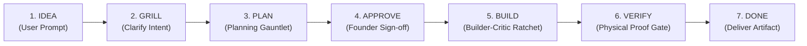
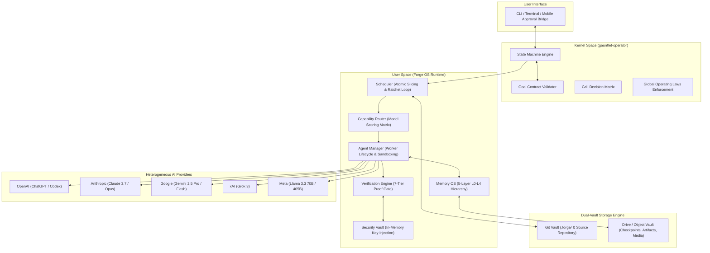

# Forge OS

> **The Portable, Multi-Provider AI Operating System**  
> Orchestrating autonomous multi-model collaboration across heterogeneous frontier AI providers without vendor lock-in.

[](LICENSE)
[](.forge/state.json)
[](https://github.com/liplnwza548/gauntlet-operator)

---

## 1. Founder Vision

Modern AI development is constrained by two extremes: monolithic single-model agent frameworks tied to proprietary APIs, and fragile orchestration scripts incapable of long-running resilience. 

**Forge OS** is an AI-native Operating System. It treats heterogeneous frontier AI models—**ChatGPT, Claude, Gemini, Grok, Meta Llama, and Codex**—not as proprietary silos, but as swappable, specialized computing processes managed by a centralized POSIX-like kernel.

### The Non-Negotiable User Experience

Behind the scenes, Forge OS coordinates adversarial planning gauntlets, distributed scheduler ratchets, memory compactions, and outsider verification audits. But for the user, the entire operating system presents a clean 6-stage lifecycle:



---

## 2. The Five Global Operating Laws

1. **Law of the Clean Frontier**: The user is grilled exclusively on core intent and trade-offs. Once the decision frontier is exhausted, the system immediately moves to planning without circular questioning.
2. **Law of Independent Verification**: No worker may verify its own output. Every line of code written by a Builder must be evaluated by a clean-slate Critic.
3. **Law of Atomic Progress (The Ratchet)**: Changes move forward strictly in verified, immutable increments ($\le 100$ lines). A failed slice causes an instantaneous rollback to the last verified champion commit.
4. **Law of Total Isolation**: Agent workers have zero direct network access to credential storage, zero cross-session memory contamination, and run isolated within ephemeral filesystems.
5. **Law of Founder Sovereignty**: No build actions, external deployments, or irreversible state mutations occur without explicit human approval at Stage 4 (`APPROVE`).

---

## 3. High-Level Architecture



---

## 4. Architectural Specifications

The complete engineering blueprint of Forge OS is documented across 15 modular specifications in [`docs/architecture/`](docs/architecture/):

| # | Specification Document | Description & Core Focus |
|---|---|---|
| 01 | [Vision & Comparison](docs/architecture/01_FORGE_VISION.md) | Architectural comparison with CrewAI, AutoGen, LangGraph, and Claude Code. Core design tenets. |
| 02 | [Kernel Architecture](docs/architecture/02_KERNEL_ARCHITECTURE.md) | Policy vs mechanism separation, state invariants, and external kernel integration. |
| 03 | [Runtime Architecture](docs/architecture/03_RUNTIME_ARCHITECTURE.md) | Headless daemon lifecycle, PID file-locks, 15s heartbeats, and <3s crash recovery. |
| 04 | [Memory OS](docs/architecture/04_MEMORY_OS.md) | 5-layer hierarchy (L0 Working Context to L4 Global Memory), Decision Graph, and Smart Compactor. |
| 05 | [Agent Manager](docs/architecture/05_AGENT_MANAGER.md) | Normalized `ForgeWorker` process model, provider abstraction, and context wiping. |
| 06 | [Scheduler & Ratchet](docs/architecture/06_SCHEDULER.md) | Atomic task slicing ($\le 100$ lines), Builder-Critic pairing, and ratchet loop rollback logic. |
| 07 | [Capability Router](docs/architecture/07_CAPABILITY_ROUTER.md) | 8-dimension task scoring, provider performance matrix, dynamic failover, and cost optimization. |
| 08 | [Dual-Vault Storage](docs/architecture/08_STORAGE_LAYER.md) | Git Vault (code & contracts) + Google Drive / S3 Vault (multimodal artifacts & checkpoints). |
| 09 | [Cloud Runtime](docs/architecture/09_CLOUD_RUNTIME.md) | 24/7 autonomous daemon operation across Mini PCs, cloud VPS, and serverless runtimes. |
| 10 | [Project Ledger](docs/architecture/10_PROJECT_LEDGER.md) | Standardized `.forge/` layout, atomic state serialization, and append-only event streaming. |
| 11 | [State Machine](docs/architecture/11_STATE_MACHINE.md) | Formal 13-state transition model, forbidden transitions, and unexpected discovery routing. |
| 12 | [Security Model](docs/architecture/12_SECURITY_MODEL.md) | Ephemeral process credentials, real-time stdout redaction, path traversal shields, and AST auditing. |
| 13 | [Verification Model](docs/architecture/13_VERIFICATION_MODEL.md) | 7-tier verification matrix, physical evidence gates, and mandatory outsider Scrutinize audits. |
| 14 | [Repository Layout](docs/architecture/14_REPOSITORY_LAYOUT.md) | Monorepo structure, package dependency hierarchy, and boundary enforcement rules. |
| 15 | [Roadmap & Critic Pass](docs/architecture/15_ROADMAP_V0_TO_V1.md) | Milestones from v0.2 to v1.0, Founder Critic synthesis, and active RFC pipeline (RFC-001–004). |

---

## 5. Monorepo Structure

```
forge-os/
├── .forge/                      # On-disk state machine, contract, and audit ledger
│   ├── goal_contract.json       # Machine-readable sealed contract
│   ├── GOAL_CONTRACT.md         # Human-readable contract representation
│   ├── state.json               # Active lifecycle state and champion commit
│   ├── ledger.jsonl             # Append-only structured event log
│   ├── workers/                 # Worker process leases and daemon heartbeats
│   ├── tasks/                   # Task queues: ready, in_flight, completed
│   └── memory/                  # Post-mortems, compaction scratchpads, checkpoints
├── docs/                        # Complete system documentation
│   ├── architecture/            # The 15 core architectural specifications
│   └── rfc/                     # Architectural requests for comment
├── packages/                    # Planned modular packages (Genesis stage: unbuilt)
│   ├── kernel/                  # Policy enforcement engine (gauntlet-operator integration)
│   ├── runtime/                 # Headless daemon and execution supervisor
│   ├── scheduler/               # Atomic slice planner and ratchet loop manager
│   ├── agent-manager/           # Normalized multi-provider worker pools
│   ├── memory/                  # 5-layer hierarchical memory engine
│   ├── storage/                 # Dual-vault sync (Git + Google Drive / S3)
│   ├── security/                # Credential isolation and stdout redaction
│   └── cli/                     # Developer terminal interface
├── LICENSE                      # MIT Open Source License
└── README.md                    # Project overview and index
```

---

## 6. The Founder Critic Pass (Hardening the OS)

Before committing to code, the architecture underwent a rigorous Founder Critic red-team review. Four critical design challenges were addressed and formally cataloged into RFCs:

1. **RFC-001: Copy-on-Write (CoW) Virtual Workspace**  
   *Problem*: Builder experiments can leave broken dependencies or orphan files before a Critic rejection.  
   *Solution*: Ephemeral overlay directories where only verified slices are committed to the host workspace.
2. **RFC-002: Cloud Storage Abstraction Layer (CSAL)**  
   *Problem*: Google Drive API rate limits (100 QPS) throttle high-frequency checkpoint operations.  
   *Solution*: Pluggable storage drivers supporting S3, Cloudflare R2, local NAS, and Google Drive.
3. **RFC-003: Mobile & Web Approval Bridge**  
   *Problem*: 24/7 headless cloud nodes stall at `AWAITING_APPROVAL` if the user is away from the terminal.  
   *Solution*: Lightweight webhook notification bridge (Push notifications / Telegram) with cryptographic signature validation.
4. **RFC-004: Universal Cross-Platform IPC**  
   *Problem*: Unix domain sockets are non-portable to Windows workstations.  
   *Solution*: High-performance local HTTP/WebSocket loopback (`127.0.0.1`) secured with ephemeral bearer tokens.

---

## 7. Current Project State

Forge OS is currently in **Phase 3: `AWAITING_APPROVAL`**.

In accordance with the **Kernel Immutability Invariant** and **Law of Founder Sovereignty**:
- 100% of the architectural blueprints have been verified.
- **Zero implementation code has been written.**
- The runtime execution engine will remain halted until the Founder explicitly reviews the blueprints and issues the approval signature to transition to `BUILD`.

To inspect the machine-readable contract and state:
```bash
cat .forge/goal_contract.json
cat .forge/state.json
```

---

## 8. License

Forge OS is open-source software licensed under the [MIT License](LICENSE).
