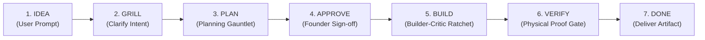
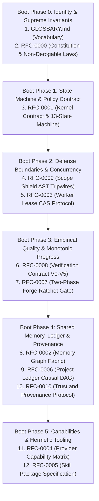

# Forge OS

> **The Portable, Multi-Provider AI Operating System**  
> Orchestrating autonomous multi-model collaboration across heterogeneous frontier AI providers without vendor lock-in.

---

## 1. Architecture Status & Ratification

Forge OS Architecture v1.0.0 has been formally audited, verified, and sealed under **Founder Freeze**:
- **Constitution Version**: `1.2.0` ([RFC-0000](docs/rfc/RFC-0000_FORGE_CONSTITUTION.md))
- **RFC Corpus**: 13 Canonical Specifications ([`docs/rfc/`](docs/rfc/))
- **Golden Test Suite**: 100% Verified Coverage ([`docs/golden-tests/`](docs/golden-tests/))
- **Runtime Execution Status**: `LOCKED` (Awaiting Founder Authorization for Milestone v0.3)

---

## 2. Founder Vision

Modern AI development is constrained by two extremes: monolithic single-model agent frameworks tied to proprietary APIs, and fragile orchestration scripts incapable of long-running resilience. 

**Forge OS** is an AI-native Operating System. It treats heterogeneous frontier AI models—**ChatGPT, Claude, Gemini, Grok, Meta Llama, and Codex**—not as proprietary silos, but as swappable, specialized computing processes managed by a centralized POSIX-like kernel.

### The Non-Negotiable User Experience

Behind the scenes, Forge OS coordinates adversarial planning gauntlets, distributed scheduler ratchets, memory compactions, and outsider verification audits. But for the user, the entire operating system presents a clean 6-stage lifecycle:

---

## 3. The Five Non-Derogable Constitutional Laws

1. **Law I: Absolute Human Primacy**: The user is grilled exclusively on core intent and trade-offs. Once the decision frontier is exhausted, the system immediately moves to planning without circular questioning. No state advances past Stage 4 (`APPROVE`) without explicit Founder HMAC authorization.
2. **Law II: Incorruptible Audit Trail**: Every action is recorded as a parent-linked event in an append-only Causal Event DAG ([RFC-0006](docs/rfc/RFC-0006_PROJECT_LEDGER_PROTOCOL.md)).
3. **Law III: Strict Boundary Isolation**: No worker may modify files outside `approved_scope`. Modifications are strictly jailed via Scope Shield AST diff analysis ([RFC-0009](docs/rfc/RFC-0009_SCOPE_SHIELD_PROTOCOL.md)) and 4D skill sandboxes ([RFC-0005](docs/rfc/RFC-0005_SKILL_PACKAGE_SPEC.md)).
4. **Law IV: Empirical Verification Precedence**: Model self-attestations carry zero evidential weight. Monotonic forward progress requires physical exit code proofs ($V_0$–$V_5$, [RFC-0008](docs/rfc/RFC-0008_VERIFICATION_CONTRACT_PROTOCOL.md)).
5. **Law V: Unconditional Revocation**: The Founder possesses instant break-glass revocation over any active lease ([RFC-0003](docs/rfc/RFC-0003_WORKER_LEASE_PROTOCOL.md)).

---

## 4. The Forge Boot Sequence (Reading Order for AI Providers)

When an autonomous cognitive model (ChatGPT, Gemini, Claude, Grok, Meta AI) is instantiated as a worker within Forge OS, it MUST ingest and execute the following boot sequence before accepting task slices or critic assignments:

See [**`docs/rfc/README.md`**](docs/rfc/README.md) for full cognitive bootstrap directives and inter-RFC dependency graphs.

---

## 5. Architectural Roadmap

- ✅ **Milestone v1.0.0-architecture (CURRENT)**: Complete RFC Layer, Golden Test Suite, Founder Freeze & Ratification.
- ⏳ **Milestone v0.3 (NEXT)**: Runtime Skeleton (`packages/kernel`, `packages/runtime`, `packages/cli`). *Blocked until Founder explicitly authorizes runtime code generation.*
- ⏳ **Milestone v0.4**: Multi-Provider Distributed Scheduler & Cloud Deployment.
- ⏳ **Milestone v1.0**: General Production Release.

---

## 6. Repository Architecture Map

- **[Architecture Summary](docs/ARCHITECTURE_SUMMARY.md)**: Executive overview of Forge OS.
- **[RFC Layer](docs/rfc/)**: Canonical 13 architectural specifications (RFC-0000 through RFC-0010).
- **[Golden Tests](docs/golden-tests/)**: 100% verified test coverage reports and audit certificates.
- **[Ratification Package](docs/ratification/)**: Official Ratification Records and Architecture Manifest.
- **[AI Provider Handoff](HANDOFF_ARCHITECTURE_v1.0.md)**: Autonomous agent bootstrap guide.
- **[Governance Workflow](docs/GOVERNANCE.md)**: RFC amendment procedures.
- **[Release Notes](RELEASE_NOTES_v1.0.0.md)**: Release notes for v1.0.0-architecture.

---

## 7. License & Community

Forge OS is open-source software licensed under the **[Apache-2.0 License](LICENSE)**.
See [CONTRIBUTING.md](CONTRIBUTING.md), [CODE_OF_CONDUCT.md](CODE_OF_CONDUCT.md), and [SECURITY.md](SECURITY.md) for participation guidelines.
