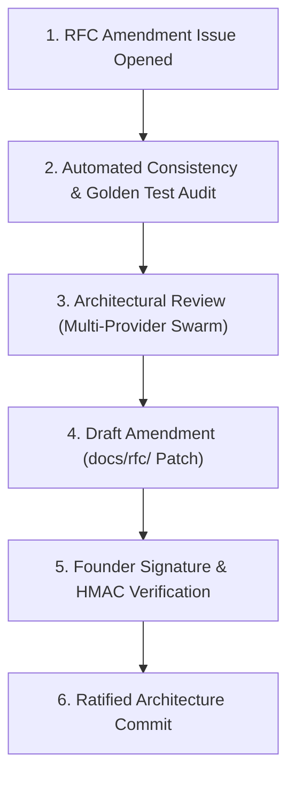

# Forge OS Architectural Governance & RFC Amendment Protocol

```yaml
Protocol: Architectural Governance
Document: GOVERNANCE.md
Authority: Derived from RFC-0000 (Forge Constitution)
Founder: LiplnwZa
Chief Architect: ChatGPT GPT-5
Target Version: v1.0.0-architecture+
```

---

## 1. Governance Principles

Forge OS is governed under strict Constitutional Supremacy ([RFC-0000](rfc/RFC-0000_FORGE_CONSTITUTION.md)). All updates, proposals, and refinements to the operating system's specifications must preserve the Five Non-Derogable Laws:
1. **Absolute Human Primacy**
2. **Incorruptible Audit Trail**
3. **Strict Boundary Isolation**
4. **Empirical Verification Precedence**
5. **Unconditional Revocation**

---

## 2. RFC Amendment Workflow



### Stage 1: Proposal Submission
Any contributor or AI provider agent may submit an RFC Amendment Proposal by creating an issue under `.github/ISSUE_TEMPLATE/rfc_amendment.md`.

### Stage 2: Automated Consistency Audit
The proposal is run through the Golden Test Suite (`docs/golden-tests/`). The amendment must not introduce:
- Constitutional contradictions (Level 0 violations).
- Symbol collisions (e.g., mixing $V_0$–$V_5$ verification levels with $L_0$–$L_4$ memory layers).
- Cyclic dependencies between RFC contracts.

### Stage 3: Multi-Provider Architectural Review
The amendment is evaluated by a multi-provider Critic swarm operating under lineage orthogonality ([RFC-0004](rfc/RFC-0004_PROVIDER_CAPABILITY_MATRIX.md)).

### Stage 4: Founder Ratification
Under Constitutional Law I (*Human Primacy*), no RFC amendment is valid without explicit HMAC authorization and signature from Founder `LiplnwZa`.

---

## 3. Amendment Log Rules

All ratified amendments must update `amendment_log` in the frontmatter of [RFC-0000](rfc/RFC-0000_FORGE_CONSTITUTION.md) and be recorded in [CHANGELOG.md](../CHANGELOG.md).
