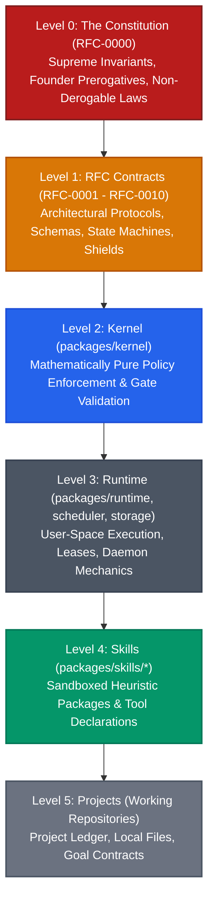
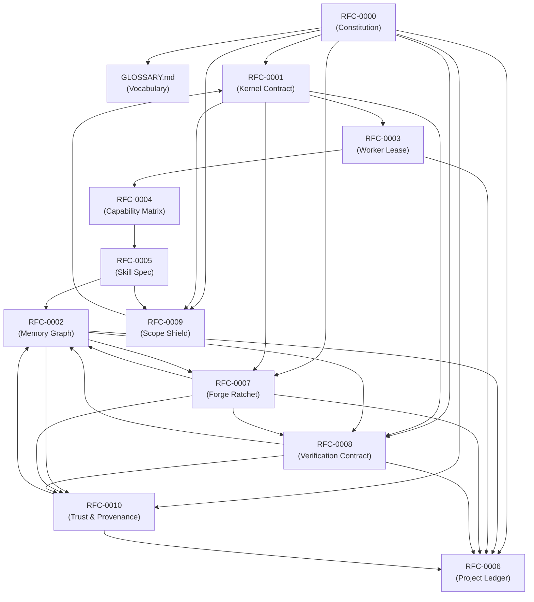
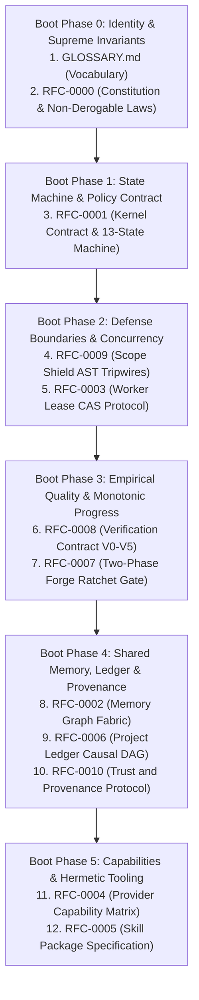

# Forge OS Request for Comments (RFC) Layer

> **The Canonical Architectural Governance Corpus for Forge OS**  
> Governing immutable policies, runtime protocols, memory graphs, worker coordination, security shields, and audit streams.

---

## 1. Master RFC Index & Status Table

| RFC | Title | Status | Tier / Level | Target | Summary |
|---|---|---|---|---|---|
| [**GLOSSARY**](GLOSSARY.md) | **Canonical System Glossary** | `FOUNDER_FREEZE` | **Reference** | v0.2+ | Single authoritative vocabulary source for all Forge terms, definitions, and concepts. |
| [**RFC-0000**](RFC-0000_FORGE_CONSTITUTION.md) | **The Constitution of Forge OS** | `FOUNDER_FREEZE` | **Level 0 (Supreme)** | v0.2+ | Supreme charter: Founder Sovereignty, Non-Derogable Laws, Authority Hierarchy ($L_0$–$L_5$). |
| [**RFC-0001**](RFC-0001_KERNEL_CONTRACT.md) | **The Kernel Contract** | `FOUNDER_FREEZE` | **Level 1 (Kernel)** | v0.2+ | Pure mathematical policy boundaries, 13-state machine, canonical 11-field Goal Contract, hash rules. |
| [**RFC-0002**](RFC-0002_MEMORY_GRAPH_PROTOCOL.md) | **Memory Graph Protocol** | `FOUNDER_FREEZE` | **Level 1 (Protocol)** | v0.3+ | 6-tier Memory Graph ($E_0$–$L_4$), Provenance Chain schema, trust scoring, and Checkpoint Protocol. |
| [**RFC-0003**](RFC-0003_WORKER_LEASE_PROTOCOL.md) | **Worker Lease Protocol** | `FOUNDER_FREEZE` | **Level 1 (Protocol)** | v0.3+ | Single-writer task leases, CAS lease renewals (nonce validation), heartbeats, and crash recovery. |
| [**RFC-0004**](RFC-0004_PROVIDER_CAPABILITY_MATRIX.md) | **Provider Capability Matrix** | `FOUNDER_FREEZE` | **Level 1 (Protocol)** | v0.3+ | Brand-neutral semantic descriptors, dynamic health EWMA, and Builder/Critic orthogonality. |
| [**RFC-0005**](RFC-0005_SKILL_PACKAGE_SPEC.md) | **Skill Package Specification** | `FOUNDER_FREEZE` | **Level 1 (Protocol)** | v0.4+ | Hermetic package layout, 4D sandboxing (universal network proxy), and reference `skills/wayfinder/`. |
| [**RFC-0006**](RFC-0006_PROJECT_LEDGER_PROTOCOL.md) | **Project Ledger Protocol** | `FOUNDER_FREEZE` | **Level 1 (Protocol)** | v0.3+ | Append-only event-sourced audit backbone, Causal Event DAG (`parent_event_id`), 17 canonical events. |
| [**RFC-0007**](RFC-0007_FORGE_RATCHET_PROTOCOL.md) | **Forge Ratchet Protocol** | `FOUNDER_FREEZE` | **Level 1 (Protocol)** | v0.3+ | Two-phase Ratchet Gate (Entry Condition vs. Advancement Transaction), Verification Levels ($V_0$–$V_5$). |
| [**RFC-0008**](RFC-0008_VERIFICATION_CONTRACT_PROTOCOL.md) | **Verification Contract Protocol** | `FOUNDER_FREEZE` | **Level 1 (Protocol)** | v0.3+ | Canonical $V_0$–$V_5$ verification schemas, physical evidence receipts, critic orthogonality, and timeouts. |
| [**RFC-0009**](RFC-0009_SCOPE_SHIELD_PROTOCOL.md) | **Scope Shield Protocol** | `FOUNDER_FREEZE` | **Level 1 (Protocol)** | v0.2+ | Boundary confinement, AST diff analysis, whitelist enforcement, and direct `REPLAN_REQUIRED` tripwires. |
| [**RFC-0010**](RFC-0010_TRUST_AND_PROVENANCE_PROTOCOL.md) | **Trust and Provenance Protocol** | `FOUNDER_FREEZE` | **Level 1 (Protocol)** | v0.3+ | End-to-end cryptographic chain of custody, prompt hashing, critic attestation, and zero-trust verification. |

---

## 2. Constitutional Authority Hierarchy

#### Universal Subordination Rule:
> **"Lower authority may extend. Lower authority may never contradict higher authority."**

---

## 3. Inter-RFC Dependency Graph

---

## 4. The Forge Boot Sequence (Reading Order for AI Providers)

When an autonomous cognitive model (ChatGPT, Gemini, Claude, Grok, Meta AI) is instantiated as a worker within Forge OS, it MUST ingest and execute the following boot sequence before accepting task slices or critic assignments:

### Cognitive Bootstrap Directives:
1. **Boot Phase 0 (Identity & Supremacy)**: Absorb [**GLOSSARY.md**](GLOSSARY.md) and [**RFC-0000**](RFC-0000_FORGE_CONSTITUTION.md). Internalize the Five Non-Derogable Laws: Founder Sovereignty is absolute; natural language declarations carry zero evidential weight.
2. **Boot Phase 1 (Lifecycle & State Machine)**: Process [**RFC-0001**](RFC-0001_KERNEL_CONTRACT.md). Understand the 13-state deterministic machine and the 11-field Goal Contract. Acknowledge that workers cannot advance state past approval gates without Founder HMAC signature.
3. **Boot Phase 2 (Confinement & Coordination)**: Study [**RFC-0009**](RFC-0009_SCOPE_SHIELD_PROTOCOL.md) and [**RFC-0003**](RFC-0003_WORKER_LEASE_PROTOCOL.md). Enforce path AST whitelists strictly. Understand that exceeding 100 modified lines or writing outside `approved_scope` trips immediate reversion to Champion Commit and triggers `REPLAN_REQUIRED`. Understand CAS lease renewal with nonce verification.
4. **Boot Phase 3 (Empirical Proof & Ratchet)**: Master [**RFC-0008**](RFC-0008_VERIFICATION_CONTRACT_PROTOCOL.md) and [**RFC-0007**](RFC-0007_FORGE_RATCHET_PROTOCOL.md). Never submit an artifact without passing the mandatory $V_0$–$V_5$ verification levels. Critics must be strictly orthogonal in model lineage from Builders.
5. **Boot Phase 4 (Memory & Auditability)**: Ingest [**RFC-0002**](RFC-0002_MEMORY_GRAPH_PROTOCOL.md), [**RFC-0006**](RFC-0006_PROJECT_LEDGER_PROTOCOL.md), and [**RFC-0010**](RFC-0010_TRUST_AND_PROVENANCE_PROTOCOL.md). Maintain immutable provenance chains on all generated nodes and record all activity as parent-linked events in the Causal DAG Ledger.
6. **Boot Phase 5 (Capabilities & Sandboxed Tools)**: Review [**RFC-0004**](RFC-0004_PROVIDER_CAPABILITY_MATRIX.md) and [**RFC-0005**](RFC-0005_SKILL_PACKAGE_SPEC.md). Execute all tool invocations through the 4D hermetic sandbox and loopback proxy.

---

## 5. Human & Engineering Reading Tracks

### Track A: Founder & System Operators
1. [**GLOSSARY.md**](GLOSSARY.md) — Master vocabulary.
2. [**RFC-0000: The Constitution**](RFC-0000_FORGE_CONSTITUTION.md) — Non-Derogable Laws, Human Primacy.
3. [**RFC-0009: Scope Shield Protocol**](RFC-0009_SCOPE_SHIELD_PROTOCOL.md) — Boundary defense and tripwires.
4. [**RFC-0008: Verification Contract Protocol**](RFC-0008_VERIFICATION_CONTRACT_PROTOCOL.md) — Human verification rules and escalation gates.
5. [**RFC-0007: Forge Ratchet Protocol**](RFC-0007_FORGE_RATCHET_PROTOCOL.md) — Two-phase gate and progress rules.
6. [**RFC-0006: Project Ledger Protocol**](RFC-0006_PROJECT_LEDGER_PROTOCOL.md) — Causal Event DAG audit trail.

### Track B: Kernel & Policy Engineers
1. [**RFC-0001: The Kernel Contract**](RFC-0001_KERNEL_CONTRACT.md) — Pure policy boundaries, 13-state machine, hashing algorithms.
2. [**RFC-0008: Verification Contract Protocol**](RFC-0008_VERIFICATION_CONTRACT_PROTOCOL.md) — Deterministic V0-V5 evidence schemas and receipt validation.
3. [**RFC-0007: Forge Ratchet Protocol**](RFC-0007_FORGE_RATCHET_PROTOCOL.md) — Phase 1 Entry Condition evaluation.
4. [**RFC-0009: Scope Shield Protocol**](RFC-0009_SCOPE_SHIELD_PROTOCOL.md) — Scope confinement assertion.
5. [**RFC-0010: Trust and Provenance Protocol**](RFC-0010_TRUST_AND_PROVENANCE_PROTOCOL.md) — Cryptographic verification algorithms.

### Track C: Runtime & Distributed Scheduler Engineers
1. [**RFC-0003: Worker Lease Protocol**](RFC-0003_WORKER_LEASE_PROTOCOL.md) — CAS renewals, heartbeats, takeover election.
2. [**RFC-0004: Provider Capability Matrix**](RFC-0004_PROVIDER_CAPABILITY_MATRIX.md) — Routing algorithm, Builder/Critic orthogonality.
3. [**RFC-0005: Skill Package Specification**](RFC-0005_SKILL_PACKAGE_SPEC.md) — Universal sandboxing and process execution.
4. [**RFC-0008: Verification Contract Protocol**](RFC-0008_VERIFICATION_CONTRACT_PROTOCOL.md) — Execution timeouts, process termination, and flaky test quarantine.

### Track D: Memory & Intelligence Engineers
1. [**RFC-0002: Memory Graph Protocol**](RFC-0002_MEMORY_GRAPH_PROTOCOL.md) — $E_0$ to $L_4$ layers, ontology, Provenance Chain.
2. [**RFC-0010: Trust and Provenance Protocol**](RFC-0010_TRUST_AND_PROVENANCE_PROTOCOL.md) — Provenance validation and trust scoring.
3. [**RFC-0006: Project Ledger Protocol**](RFC-0006_PROJECT_LEDGER_PROTOCOL.md) — Checkpointing and event DAG correlation.

---

## 6. Architectural Corrections Summary Table

Across Cycles 1 through 5, all discovered architectural contradictions and gaps were resolved and codified:

| ID | Issue in Earlier Drafts | Codified Resolution | Governing Document |
|---|---|---|---|
| **AC-01** | Kernel Boundary Ambiguity | Kernel is strictly referentially transparent policy with zero external dependencies. | [RFC-0001](RFC-0001_KERNEL_CONTRACT.md) |
| **AC-02** | Hierarchical Memory Silos | Replaced isolated directory trees with a unified, typed Memory Graph Fabric ($E_0$ to $L_4$). | [RFC-0002](RFC-0002_MEMORY_GRAPH_PROTOCOL.md) |
| **AC-03** | Rollback Memory Desync | Checkpoint Protocol atomically restores Memory Graph with Git Champion Commit. | [RFC-0002](RFC-0002_MEMORY_GRAPH_PROTOCOL.md), [RFC-0007](RFC-0007_FORGE_RATCHET_PROTOCOL.md) |
| **AC-04** | Zombie Worker Heartbeats | Introduced a 10-minute hard monotonic task deadline overriding heartbeats. | [RFC-0003](RFC-0003_WORKER_LEASE_PROTOCOL.md) |
| **AC-05** | Lease Overwrite Race Condition | Replaced blind rename with Compare-And-Swap (CAS) nonce validation on lease renewal. | [RFC-0003](RFC-0003_WORKER_LEASE_PROTOCOL.md) |
| **AC-06** | Vendor Brand Hardcoding | Replaced brand names with abstract Semantic Capability Descriptors & lineage tokens. | [RFC-0004](RFC-0004_PROVIDER_CAPABILITY_MATRIX.md) |
| **AC-07** | Local Workstation Net Escape | Enforced universal loopback proxy confinement across all local and cloud environments. | [RFC-0005](RFC-0005_SKILL_PACKAGE_SPEC.md) |
| **AC-08** | Missing GOAL_AMENDED Event | Added canonical `GOAL_AMENDED` event to the ledger catalog and JSON schema (17 events total). | [RFC-0006](RFC-0006_PROJECT_LEDGER_PROTOCOL.md) |
| **AC-09** | Ledger Clock Jitter & Causality| Structured ledger into an immutable Causal Event DAG using `parent_event_id`. | [RFC-0006](RFC-0006_PROJECT_LEDGER_PROTOCOL.md) |
| **AC-10** | Ratchet Precondition Deadlock | Split Ratchet Gate into Phase 1 Entry Condition vs. Phase 2 Advancement Transaction. | [RFC-0007](RFC-0007_FORGE_RATCHET_PROTOCOL.md) |
| **AC-11** | Lexical Symbol Collision | Renamed Verification Levels to $V_0$–$V_5$, reserving $L_n$ strictly for Memory Layers. | [GLOSSARY](GLOSSARY.md), [RFC-0001](RFC-0001_KERNEL_CONTRACT.md), [RFC-0002](RFC-0002_MEMORY_GRAPH_PROTOCOL.md), [RFC-0007](RFC-0007_FORGE_RATCHET_PROTOCOL.md) |
| **AC-12** | Missing Approval Hash Timestamp| Added `approved_at` and `founder_id` to Goal Contract schema for deterministic HMAC validation. | [RFC-0001](RFC-0001_KERNEL_CONTRACT.md) |
| **AC-13** | Scope Shield Formalization | Elevated boundary defense into standalone specification with direct replanning tripwires. | [RFC-0009](RFC-0009_SCOPE_SHIELD_PROTOCOL.md) |
| **AC-14** | Cryptographic Provenance Chain | Mandated structured cryptographic provenance chains across all memory nodes and diffs. | [RFC-0010](RFC-0010_TRUST_AND_PROVENANCE_PROTOCOL.md) |
| **AC-15** | Formal Verification Contracts | Codified dedicated Verification Contract protocol with machine-readable receipt schemas. | [RFC-0008](RFC-0008_VERIFICATION_CONTRACT_PROTOCOL.md) |
| **AC-16** | Flaky Test Quarantine Protocol| Established formal quarantine state and determinism thresholds to eliminate CI deadlocks. | [RFC-0008](RFC-0008_VERIFICATION_CONTRACT_PROTOCOL.md) |
