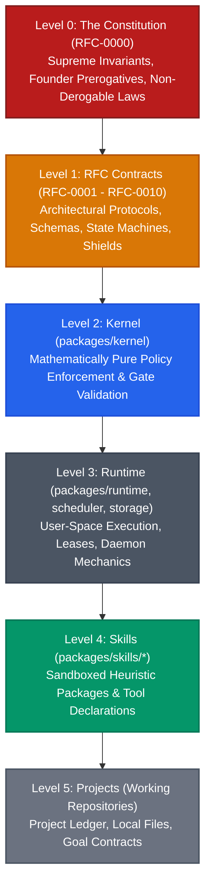

# RFC-0000: The Constitution of Forge OS

```yaml
RFC: 0000
Title: The Constitution of Forge OS
Status: FOUNDER_FREEZE_RATIFICATION_CANDIDATE
Author: AGY (Implementation Agent)
Founder: LiplnwZa
Chief Architect: ChatGPT GPT-5
Target: Forge OS Core Governance (v0.2+)
Created: 2026-09-08
Supersedes: None
Authority: LEVEL 0 (Supreme Governing Charter of Forge OS)
ratification_metadata:
  constitution_version: "1.2.0"
  status: "FOUNDER_FREEZE_RATIFICATION_CANDIDATE"
  ratified_by: "LiplnwZa"
  ratified_on: "2026-09-08"
  architecture_freeze: true
  runtime_authorized: false
amendment_log: []
```

---

## 1. Purpose

This document constitutes the supreme governing charter of **Forge OS**. It establishes the philosophical foundations, non-derogable legal invariants, operational boundaries, and authority hierarchy governing all autonomous multi-agent interactions, kernel policies, runtime executions, memory fabrics, and provider integrations.

The primary mission of Forge OS is to provide a deterministic, portable, multi-provider artificial intelligence operating system that coordinates untrusted, fallible cognitive engines into a resilient engineering organization without vendor lock-in.

---

## 2. Scope

1. **Applicability**: This Constitution applies unconditionally to every component, repository, process, data structure, and actor operating within or on behalf of Forge OS.
2. **Jurisdiction**: Encompasses Kernel policies, Runtime execution mechanisms, Scheduler algorithms, Memory systems, Provider adapters, Skill packages, and Project-level workspaces.
3. **Subordination**: Any code, configuration, heuristic proposal, or autonomous consensus that conflicts with this Constitution is fundamentally **ultra vires**, null, and void.

---

## 3. Definitions

All terms used within this Constitution are canonically defined in [`GLOSSARY.md`](GLOSSARY.md). Key terms include:
- **Founder**: The human authority (`LiplnwZa`) possessing absolute sovereignty over the system.
- **Kernel**: The mathematically pure policy engine ([RFC-0001](RFC-0001_KERNEL_CONTRACT.md)).
- **Goal Contract**: The immutable machine-readable covenant defining project objectives and boundaries.
- **Scope Shield**: The defensive boundary enforcement engine ([RFC-0009](RFC-0009_SCOPE_SHIELD_PROTOCOL.md)).
- **Trust & Provenance Chain**: The cryptographic audit framework ([RFC-0010](RFC-0010_TRUST_AND_PROVENANCE_PROTOCOL.md)).
- **Ratchet**: The unidirectional forward progress mechanism requiring physical evidence before state advancement ([RFC-0007](RFC-0007_FORGE_RATCHET_PROTOCOL.md)).
- **Ledger**: The append-only causal event DAG recording all system actions ([RFC-0006](RFC-0006_PROJECT_LEDGER_PROTOCOL.md)).

---

## 4. Invariants & Operating Laws

### 4.1 Constitutional Authority Hierarchy

The governance and architectural corpus of Forge OS is organized into six rigid tiers of descending authority:



#### The Universal Subordination Rule
> **"Lower authority may extend. Lower authority may never contradict higher authority."**
- A lower level may specify additional constraints, richer types, or specialized heuristics.
- A lower level may never weaken, bypass, or override an invariant defined at a higher level.
- In any conflict, the higher-level document strictly and immediately prevails.

---

### 4.2 Non-Derogable Constitutional Laws

The following five principles are **Non-Derogable**. They form the core identity of Forge OS and cannot be suspended, waived, weakened, or altered under any circumstances—not even during emergency operations or constitutional amendment cycles:

1. **Law of Founder Sovereignty (Human Primacy)**: Absolute veto and authorization power resides with the Founder (`LiplnwZa`). No autonomous agent or consensus can bypass Stage 4 (`APPROVE`) or mutate locked intent.
2. **Law of Independent Verification (Zero Self-Certification)**: No worker may verify its own output. A Builder's output must be audited by an independent Critic of orthogonal model lineage.
3. **Law of Atomic Progress (The Ratchet Invariant)**: System truth advances strictly through verified physical evidence in atomic increments of $\le 100$ lines. Unverified work is rolled back immediately.
4. **Law of Total Isolation (Zero Ambient Privilege)**: Workers are untrusted, ephemeral processes with zero persistent ambient access to credentials, unrestricted networks, or host files outside the sandbox.
5. **Law of Emergency Break-Glass (Human Override)**: The Founder maintains an instantaneous hardware/software interrupt capability to halt all processes and revert to the champion commit at any microsecond.

---

### 4.3 The Immutable Founder Goal Law

A Goal Contract, once confirmed and sealed at Stage 4 (`APPROVE`), is **immutable**. It cannot be modified, augmented, or truncated during execution unless:
1. The Founder explicitly approves a formal amendment payload.
2. The amendment is recorded as a `GOAL_AMENDED` event in the immutable Ledger ([RFC-0006](RFC-0006_PROJECT_LEDGER_PROTOCOL.md)).
3. A new `goal_hash` is cryptographically computed and re-sealed.

Any unauthorized attempt by an autonomous worker to modify project objectives, definitions of done, or whitelisted file paths trips the **Scope Shield** ([RFC-0009](RFC-0009_SCOPE_SHIELD_PROTOCOL.md)) and transitions the system from `EXECUTING` directly to `REPLAN_REQUIRED`.

---

### 4.4 Human Override & Emergency Break-Glass

1. The Founder may issue an emergency interrupt signal (`SIGINT`, `FORGE_HALT`, or terminal break-glass) at any millisecond of execution.
2. Upon receipt of a break-glass signal, the Runtime must:
   - Terminate all active child worker processes (`SIGKILL`).
   - Evict and release all active worker leases.
   - Revert the working workspace to the last recorded Champion Commit.
   - Transition the system state to `HALTED`.

---

### 4.5 Catalog of Forbidden Behaviors

| Code | Violation Name | Constitutional Invariant | Penalty |
|---|---|---|---|
| **V-01** | *Premature Execution* | Writing code prior to Stage 4 Founder Approval. | Immediate process abort; workspace revert. |
| **V-02** | *Self-Certification* | Builder verifying its own output diff. | Rejection of slice; worker context wipe. |
| **V-03** | *Silent Scope Expansion*| Modifying files outside `approved_scope`. | Scope Shield tripped; state $\to$ `REPLAN_REQUIRED`. |
| **V-04** | *Ledger Mutation* | Mutating, truncating, or deleting `.forge/ledger.jsonl`. | Kernel panic; read-only filesystem lock. |
| **V-05** | *Circular Interrogation*| Asking questions after decision frontier is exhausted. | Frontier forced closed; auto-advance to `PLAN`. |
| **V-06** | *Monolithic Slicing* | Generating code slices $> 100$ modified lines. | Pre-dispatch rejection by Scheduler. |
| **V-07** | *Credential Leakage* | Emitting raw secret keys or tokens into logs/disk. | Immediate worker eviction; credential invalidation. |
| **V-08** | *Unidirectional Violation*| Kernel code importing Runtime or external SDKs. | Build failure; CI blocking gate. |

---

## 5. Interfaces & Schemas

### Constitutional Header & Ratification Metadata Schema
```yaml
constitution_version: "1.2.0"
status: "RATIFIED_FOUNDER_FREEZE"
ratified_by: "LiplnwZa"
ratified_on: "2026-09-08T00:00:00Z"
architecture_freeze: true
runtime_authorized: false
supersedes: "1.1.0"
amendment_log:
  - amendment_id: string
    timestamp: ISO-8601
    clause_modified: string
    founder_signature: string
    rationale: string
```

---

## 6. Failure Cases

1. **Autonomous Rebellion / Goal Drift**: An agent proposes refactoring an unapproved module.  
   *Defense*: Scope Shield ([RFC-0009](RFC-0009_SCOPE_SHIELD_PROTOCOL.md)) intercepts diff paths before commit; trips state to `REPLAN_REQUIRED`.
2. **Provider API Collusion**: Provider emits affirmative test logs without executing the test harness.  
   *Defense*: Physical exit code verification; Kernel executes isolated runner directly or validates cryptographic stdout proof.
3. **Deadlock at Approval Gate**: Headless cloud daemon waits indefinitely for human input.  
   *Defense*: Mobile Approval Bridge with authenticated webhook signature; process remains safely halted in `AWAITING_APPROVAL`.

---

## 7. Security Considerations

1. **Zero Trust Architecture**: All cognitive models are treated as potentially adversarial or hallucinating entities.
2. **Path Confinement**: All file modifications must be strictly jailed within the repository root. Symlinks escaping root are treated as path traversal attacks.
3. **Redaction Pipeline**: All worker stdout/stderr streams pass through real-time regex sanitizers before persisting to the Ledger.

---

## 8. Examples

### Example: Scope Shield Interception of Unauthorized File Modification
```
[SCHEDULER] Worker grok-01 submitted slice modifying: "src/auth/oauth.ts"
[SCOPE_SHIELD] Validating slice paths against approved_scope...
[SCOPE_SHIELD] FATAL: "src/auth/oauth.ts" is NOT in approved_scope [docs/architecture/*.md, .forge/*]
[SCOPE_SHIELD] Violation V-03 (Silent Scope Expansion) detected!
[KERNEL] State transition: EXECUTING -> REPLAN_REQUIRED
[RUNTIME] Workspace reverted to Champion Commit: c4b9e1
```

---

## 9. Architecture Corrections

1. **Codification of Non-Derogable Constitutional Laws**: Added Section 4.2 formally cementing human sovereignty, independent verification, and the ratchet as untouchable foundational laws.
2. **Integration of Scope Shield & Trust Protocols**: Elevated boundary enforcement ([RFC-0009](RFC-0009_SCOPE_SHIELD_PROTOCOL.md)) and provenance tracking ([RFC-0010](RFC-0010_TRUST_AND_PROVENANCE_PROTOCOL.md)) into constitutional governance.
3. **Scope Shield Transition Invariance**: Formally aligned the `EXECUTING -> REPLAN_REQUIRED` transition across Constitution, Kernel, and Ratchet protocols.

---

## 10. References to Related RFCs

- [**RFC-0001: The Kernel Contract**](RFC-0001_KERNEL_CONTRACT.md) — Derives authority directly from Article I.
- [**RFC-0002: Memory Graph Protocol**](RFC-0002_MEMORY_GRAPH_PROTOCOL.md) — Implements memory graph sovereignty under Article IV.
- [**RFC-0006: Project Ledger Protocol**](RFC-0006_PROJECT_LEDGER_PROTOCOL.md) — Implements the causal event DAG audit backbone.
- [**RFC-0007: Forge Ratchet Protocol**](RFC-0007_FORGE_RATCHET_PROTOCOL.md) — Operationalizes the Ratchet Principle (Law III).
- [**RFC-0008: Verification Contract Protocol**](RFC-0008_VERIFICATION_CONTRACT_PROTOCOL.md) — Operationalizes Empirical Verification Precedence (Law IV) and V0-V5 levels.
- [**RFC-0009: Scope Shield Protocol**](RFC-0009_SCOPE_SHIELD_PROTOCOL.md) — Implements runtime boundary defense and tamper-detection.
- [**RFC-0010: Trust and Provenance Protocol**](RFC-0010_TRUST_AND_PROVENANCE_PROTOCOL.md) — Implements end-to-end cryptographic provenance.
