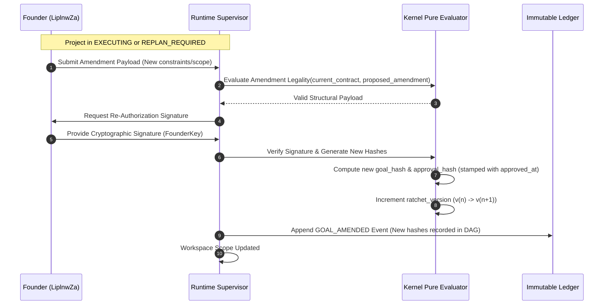
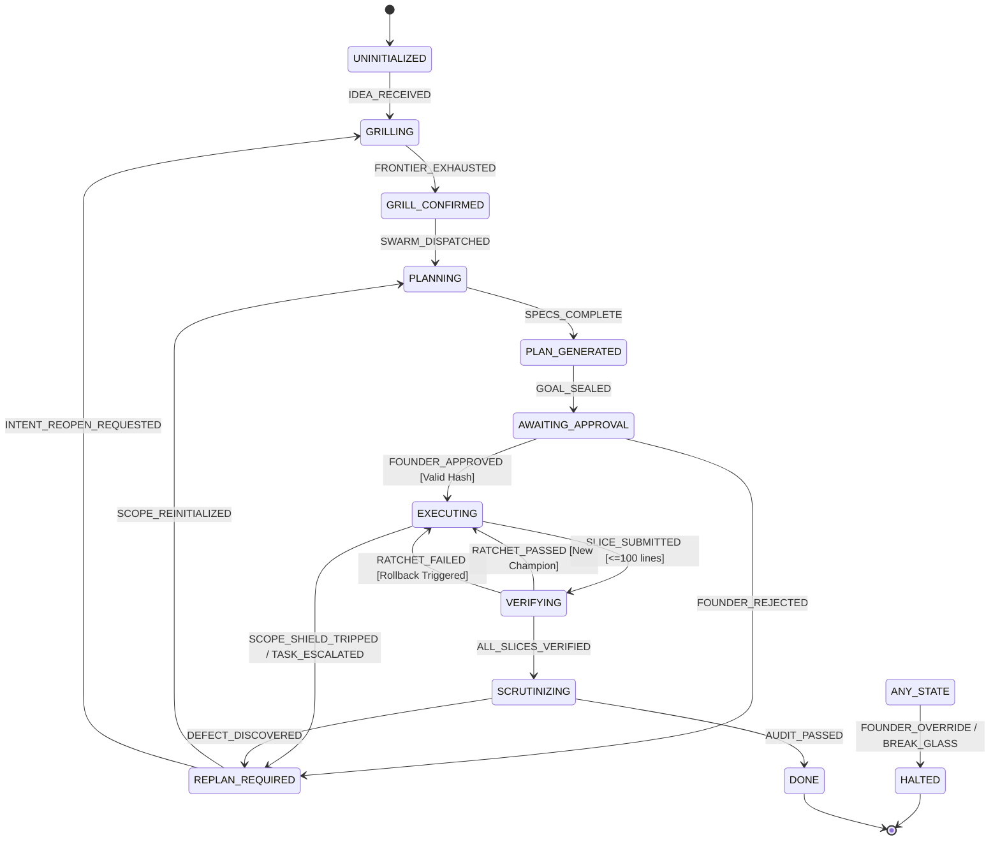

# RFC-0001: The Kernel Contract

```yaml
RFC: 0001
Title: The Kernel Contract
Status: FOUNDER_FREEZE_RELEASE_CANDIDATE
Author: AGY (Implementation Agent)
Founder: LiplnwZa
Chief Architect: ChatGPT GPT-5
Target: Forge OS Core Governance (v0.2+)
Created: 2026-09-08
Supersedes: docs/architecture/02_KERNEL_ARCHITECTURE.md
Authority: LEVEL 1 (Subordinate only to RFC-0000)
```

---

## 1. Purpose

This specification establishes the formal, mathematically pure boundary of the **Forge OS Kernel**. 

Under **RFC-0000 (The Forge Constitution)**, the Kernel is the supreme policy arbiter for system lifecycles. It evaluates the legality of state transitions, enforces goal contract invariants, computes cryptographic trust hashes, and certifies verification proofs. 

The Kernel is designed as a **referentially transparent, side-effect-free library**. It dictates *what* transitions and states are lawful, while remaining strictly detached from the mechanisms of process management, thread scheduling, network communication, or filesystem I/O.

---

## 2. Scope

1. **In-Scope**:
   - Formal 13-state semantic state machine definition and transition rules.
   - Canonical 11-field Goal Contract schema and hashing algorithms (`goal_hash`, `approval_hash`).
   - Goal amendment validation protocol.
   - Verification evidence validation and Ratchet progression rules ($\le 100$ lines, $V_0$ to $V_5$).
   - Kernel Public Export and Import interfaces (`RatchetPolicy`, `KernelExports`, `KernelImports`).
2. **Out-of-Scope (Strict Runtime Domain)**:
   - Spawning, killing, or monitoring worker child processes.
   - Network socket connections, HTTP servers, and IPC loops.
   - Reading or writing raw physical files from disk.
   - Managing vendor API keys or invoking provider SDKs.

---

## 3. Definitions

All terms conform to [`GLOSSARY.md`](GLOSSARY.md). Key terms:
- **Goal Hash (`goal_hash`)**: Cryptographic digest of immutable project intent and boundaries.
- **Approval Hash (`approval_hash`)**: Cryptographic HMAC proof of human Founder sign-off binding `approved_at` and `founder_id`.
- **Ratchet Version (`ratchet_version`)**: Monotonically increasing counter tracking verified champion increments.
- **Verification Level ($V_0$ to $V_5$)**: Standardized evaluation strictness tier.
- **Kernel Pure Evaluator**: Deterministic function mapping `(CurrentState, Event, Context) -> (NextState, LegalityVerdict)`.

---

## 4. Invariants

1. **Kernel Purity Invariant**: The Kernel must contain zero side-effects. Given identical inputs, every Kernel evaluator must return the identical result.
2. **Unidirectional Import Invariant**: 
   - Runtime modules **MAY** import Kernel interfaces.
   - Kernel modules **SHALL NEVER** import Runtime, Scheduler, Agent Manager, Storage, or CLI modules.
   - Any Kernel import of an external non-standard library or higher-tier package triggers an immediate build failure.
3. **Founder Gate Invariant**: The state transition `AWAITING_APPROVAL -> EXECUTING` is mathematically impossible without a cryptographically valid `approval_hash` signed by the Founder.
4. **Ratchet Slicing Invariant**: The Kernel will reject any task slice verification where:
   $$\text{LinesChanged} = \text{LinesAdded} + \text{LinesDeleted} > 100$$

---

## 5. Interfaces & Schemas

### 5.1 Canonical 11-Field Goal Contract Schema

```json
{
  "$schema": "http://json-schema.org/draft-07/schema#",
  "title": "ForgeGoalContract",
  "type": "object",
  "required": [
    "goal_id",
    "founder_intent",
    "founder_id",
    "success_definition",
    "constraints",
    "approval_hash",
    "approved_at",
    "goal_hash",
    "created_at",
    "ratchet_version",
    "verification_contract"
  ],
  "properties": {
    "goal_id": { "type": "string", "pattern": "^goal-[a-f0-9]{8}$" },
    "founder_intent": { "type": "string", "minLength": 10 },
    "founder_id": { "type": "string" },
    "success_definition": {
      "type": "object",
      "required": ["outcomes", "criteria", "definition_of_done"],
      "properties": {
        "outcomes": { "type": "array", "items": { "type": "string" } },
        "criteria": { "type": "array", "items": { "type": "string" } },
        "definition_of_done": { "type": "array", "items": { "type": "string" } }
      }
    },
    "constraints": {
      "type": "object",
      "required": ["technical", "environmental", "non_goals", "approved_scope"],
      "properties": {
        "technical": { "type": "array", "items": { "type": "string" } },
        "environmental": { "type": "array", "items": { "type": "string" } },
        "non_goals": { "type": "array", "items": { "type": "string" } },
        "approved_scope": { "type": "array", "items": { "type": "string" } }
      }
    },
    "approval_hash": { "type": ["string", "null"] },
    "approved_at": { "type": ["string", "null"], "format": "date-time" },
    "goal_hash": { "type": "string" },
    "created_at": { "type": "string", "format": "date-time" },
    "ratchet_version": { "type": "integer", "minimum": 0 },
    "verification_contract": {
      "type": "object",
      "required": ["min_verification_level", "independent_critic_required"],
      "properties": {
        "min_verification_level": { 
          "type": "string", 
          "enum": ["V0_SYNTAX", "V1_COMPILE", "V2_UNIT", "V3_INTEGRATION", "V4_INVARIANT", "V5_OUTSIDER"] 
        },
        "independent_critic_required": { "type": "boolean" }
      }
    }
  }
}
```

---

### 5.2 Cryptographic Hashing Rules

#### 1. Goal Hash (`goal_hash`)
The `goal_hash` uniquely seals the immutable intent and constraints of the project:
$$\text{Payload} = \text{CanonicalJSON}(\{\text{goal\_id}, \text{founder\_intent}, \text{founder\_id}, \text{success\_definition}, \text{constraints}\})$$
$$\text{goal\_hash} = \operatorname{SHA256}(\text{Payload})$$
*Note*: `CanonicalJSON` requires recursively sorting all object keys lexicographically and formatting without whitespace.

#### 2. Approval Hash (`approval_hash`)
The `approval_hash` binds human authorization to the immutable goal with zero reliance on ambient clock time:
$$\text{approval\_hash} = \operatorname{HMAC-SHA256}(\text{FounderKey}, \text{goal\_hash} \mathbin{\Vert} \text{approved\_at} \mathbin{\Vert} \text{founder\_id})$$

---

### 5.3 Goal Amendment Flow



---

### 5.4 Kernel Public Interfaces

```typescript
export type VerificationLevel = 
  | 'V0_SYNTAX'
  | 'V1_COMPILE'
  | 'V2_UNIT'
  | 'V3_INTEGRATION'
  | 'V4_INVARIANT'
  | 'V5_OUTSIDER';

export interface RatchetPolicy {
  max_lines_changed: 100;
  required_verification_level: VerificationLevel;
  require_independent_lineage: boolean;
}

export interface KernelExports {
  /** Evaluates legal state transitions */
  evaluateTransition(
    current: LifecycleState, 
    event: LifecycleEvent, 
    context: TransitionContext
  ): TransitionResult;

  /** Canonical Hashing Engine */
  computeGoalHash(contract: CanonicalGoalContractInput): string;
  verifyApprovalHash(contract: GoalContract, founderKey: string): boolean;

  /** Ratchet Verification Gate */
  evaluateRatchetGate(
    slice: TaskSlice, 
    evidence: PhysicalEvidence, 
    policy: RatchetPolicy
  ): RatchetVerdict;

  /** Scope Containment Check */
  assertScopeConfinement(modifiedPaths: string[], approvedScope: string[]): boolean;
}

export interface KernelImports {
  /** Strict mathematical/cryptographic primitives ONLY */
  crypto: {
    sha256(data: string | Uint8Array): string;
    hmacSha256(key: string, message: string): string;
  };
}
```

### Forbidden Imports
The Kernel is forbidden from importing:
- `@forge/runtime`, `@forge/scheduler`, `@forge/agent-manager`, `@forge/storage`, `@forge/cli`
- Node.js `fs`, `child_process`, `net`, `http`, `cluster`
- Any external third-party dependency outside of zero-dependency standard mathematical libraries.

---

### 5.5 Semantic State Machine & Formal Transition Table



| Source State | Event Trigger | Guard Condition / Evidence Required | Target State |
|---|---|---|---|
| `UNINITIALIZED` | `IDEA_RECEIVED` | Prompt string length $> 0$. | `GRILLING` |
| `GRILLING` | `FRONTIER_EXHAUSTED` | Open questions resolved; mutual intent confirmed. | `GRILL_CONFIRMED` |
| `GRILL_CONFIRMED`| `SWARM_DISPATCHED` | Planning agents initialized. | `PLANNING` |
| `PLANNING` | `SPECS_COMPLETE` | All required architecture documents drafted. | `PLAN_GENERATED` |
| `PLAN_GENERATED` | `GOAL_SEALED` | `goal_hash` computed from canonical 11-field Goal Contract. | `AWAITING_APPROVAL` |
| `AWAITING_APPROVAL`| `FOUNDER_APPROVED` | Cryptographically valid `approval_hash` provided. | `EXECUTING` |
| `AWAITING_APPROVAL`| `FOUNDER_REJECTED` | Scope rejection payload from Founder. | `REPLAN_REQUIRED` |
| `EXECUTING` | `SLICE_SUBMITTED` | Lines modified $\le 100$; target in `approved_scope`. | `VERIFYING` |
| `EXECUTING` | `SCOPE_SHIELD_TRIPPED` | File touch outside `approved_scope` or escalation limit. | `REPLAN_REQUIRED` |
| `VERIFYING` | `RATCHET_PASSED` | Independent Critic emit `PASS`; exit code $0$. | `EXECUTING` |
| `VERIFYING` | `RATCHET_FAILED` | Critic emit `FAIL` OR non-zero exit code. | `EXECUTING` |
| `VERIFYING` | `ALL_SLICES_DONE` | All slices completed; DoD satisfied. | `SCRUTINIZING` |
| `SCRUTINIZING` | `AUDIT_PASSED` | Clean-slate outsider audit zero critical bugs ($V_5$). | `DONE` |
| `SCRUTINIZING` | `DEFECT_DISCOVERED` | Architectural defect identified during scrutinize. | `REPLAN_REQUIRED` |
| `REPLAN_REQUIRED`| `SCOPE_REINITIALIZED` | Scope re-anchored for replanning. | `PLANNING` |
| `REPLAN_REQUIRED`| `INTENT_REOPEN_REQUESTED` | Founder indicates fundamental intent was misunderstood. | `GRILLING` |
| *ANY STATE* | `BREAK_GLASS` | Founder interrupt or fatal invariant panic. | `HALTED` |

---

## 6. Failure Cases

1. **Missing Approval Hash or Timestamp**: Runtime attempts to transition to `EXECUTING` with null `approval_hash` or unrecorded `approved_at`.  
   *Verdict*: Kernel throws `IllegalTransitionException`; state remains `AWAITING_APPROVAL`.
2. **Oversized Slice**: Builder emits diff with 101 modified lines.  
   *Verdict*: Kernel rejects slice immediately with `SliceThresholdExceededException`; zero critic resources allocated.
3. **Scope Shield Tripwire**: Worker modifies unapproved file during execution.  
   *Verdict*: Kernel forces transition `EXECUTING -> REPLAN_REQUIRED`; workspace reverted to Champion Commit.

---

## 7. Security Considerations

1. **Referential Purity as Defense**: By prohibiting I/O, the Kernel cannot be coerced into reading unauthorized disk files or making outbound network calls.
2. **Cryptographic Sealing**: The `approval_hash` binds `goal_hash`, `approved_at`, and `founder_id` via HMAC, preventing forged execution approvals.

---

## 8. Examples

### Example: Evaluator Rejection of Unauthenticated Transition
```json
// Input to Kernel Evaluator
{
  "current_state": "AWAITING_APPROVAL",
  "event": "FOUNDER_APPROVED",
  "payload": {
    "goal_id": "goal-4b9e1a02",
    "approval_hash": null,
    "approved_at": null
  }
}
// Kernel Output
{
  "legal": false,
  "error": "INVARIANT_VIOLATION: Approval hash or approved_at missing. Transition to EXECUTING is forbidden.",
  "resulting_state": "AWAITING_APPROVAL"
}
```

---

## 9. Architecture Corrections

1. **Canonical 11-Field Schema Codification**: Added `approved_at` and `founder_id` to `GoalContract` schema, resolving the approval verification deadlock without violating referential purity.
2. **Verification Level Renaming (V0–V5)**: Updated strictness tiers from `L0_SYNTAX`–`L5_OUTSIDER` to `V0_SYNTAX`–`V5_OUTSIDER`, permanently eliminating lexical collisions with Memory Layers $L_0$–$L_4$.
3. **State Machine Completeness**: Formally added `EXECUTING -> REPLAN_REQUIRED` and `REPLAN_REQUIRED -> GRILLING` to the state machine transition table.
4. **Defined RatchetPolicy Interface**: Formally declared `RatchetPolicy` within the Kernel public export interface.

---

## 10. References to Related RFCs

- [**RFC-0000: The Forge Constitution**](RFC-0000_FORGE_CONSTITUTION.md) — Supreme governing charter.
- [**RFC-0006: Project Ledger Protocol**](RFC-0006_PROJECT_LEDGER_PROTOCOL.md) — Event logging for state transitions.
- [**RFC-0007: Forge Ratchet Protocol**](RFC-0007_FORGE_RATCHET_PROTOCOL.md) — Ratchet execution mechanics and gate criteria.
- [**RFC-0009: Scope Shield Protocol**](RFC-0009_SCOPE_SHIELD_PROTOCOL.md) — Governs `SCOPE_SHIELD_TRIPPED` transition.
- [**RFC-0010: Trust and Provenance Protocol**](RFC-0010_TRUST_AND_PROVENANCE_PROTOCOL.md) — Defines cryptographic hash verification.
