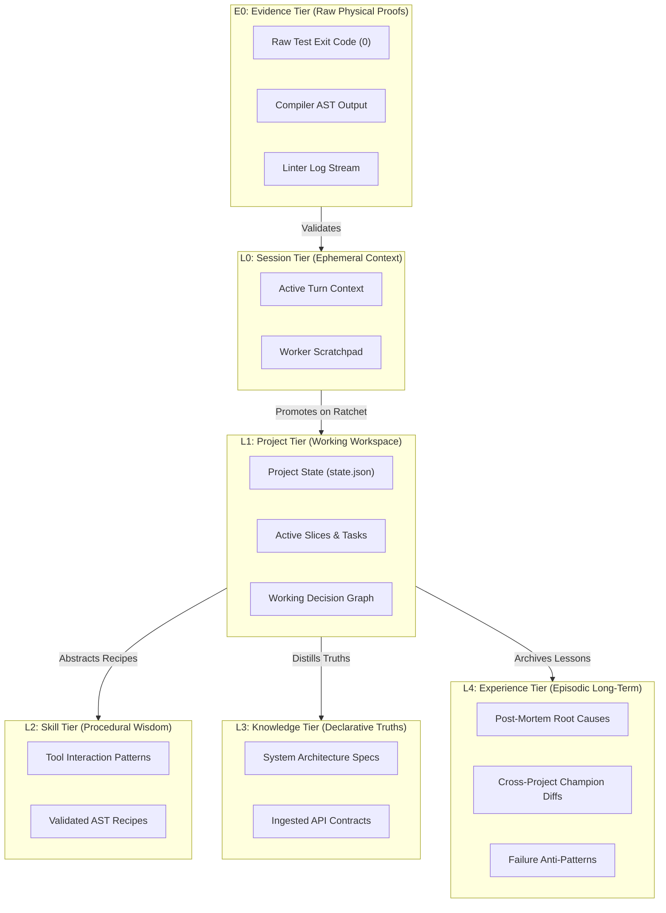
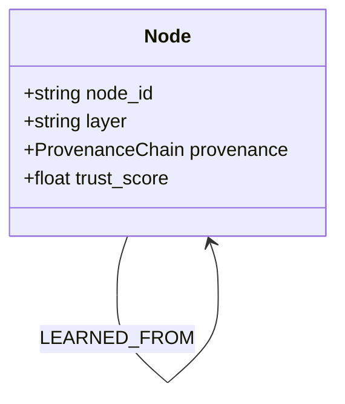
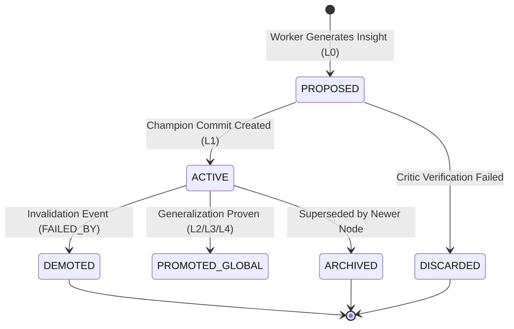

# RFC-0002: Memory Graph Protocol

```yaml
RFC: 0002
Title: Memory Graph Protocol
Status: FOUNDER_FREEZE_RELEASE_CANDIDATE
Author: AGY (Implementation Agent)
Founder: LiplnwZa
Chief Architect: ChatGPT GPT-5
Target: Forge OS Core Governance (v0.2+)
Created: 2026-09-08
Supersedes: docs/architecture/04_MEMORY_OS.md
Authority: LEVEL 1 (Subordinate to RFC-0000, Peer to RFC-0001)
```

---

## 1. Purpose

This specification defines the **Memory Graph Protocol** for Forge OS. It establishes a multi-layered, typed, and cryptographically verified graph database fabric that replaces flat filesystem hierarchies. 

The Memory Graph ensures that knowledge, architectural decisions, code patterns, and failure post-mortems are connected through explicit, traversable relationships, while strictly maintaining epistemic provenance: **no memory node is promoted without verifiable physical evidence**.

---

## 2. Scope

1. **In-Scope**:
   - The six operational memory tiers ($E_0, L_0, L_1, L_2, L_3, L_4$).
   - Canonical Node schema with embedded **Provenance Chain**, Edge relationship ontology, and JSON schemas.
   - Lifecycle operations: Create, Promote, Demote, Garbage Collect, Resume.
   - Checkpoint integrity rules and synchronization with Git Champion Commits.
   - Algorithmic calculation of the **Memory Trust Score**.
2. **Out-of-Scope**:
   - Underlying physical graph database engine implementation (e.g., SQLite, DuckDB, K/V store).
   - Embedding generation models and vector search similarity metrics (governed by Runtime).

---

## 3. Definitions

All terms conform to [`GLOSSARY.md`](GLOSSARY.md). Key terms:
- **$E_0$ Evidence**: Raw, physical artifacts (compiler logs, test exit codes, AST diffs).
- **Provenance Chain**: Embedded cryptographic audit trail tracing authorship, prompt hashes, and critic attestation.
- **Verification Levels ($V_0$ to $V_5$)**: Standard evaluation strictness tiers.
- **Promotion**: Elevating a validated memory node to a higher, more permanent layer.
- **Demotion**: Invalidating or downgrading a memory node proven false by subsequent failure.
- **Memory Trust Score**: A normalized $[0.0, 1.0]$ confidence value based on verification history.

---

## 4. Invariants

1. **Evidence-First Invariant ($E_0 \to L_n$)**: No node may be promoted to $L_1$ or higher without an explicit link to an underlying $E_0$ Evidence node.
2. **Atomic Rollback Invariant**: When the codebase rolls back to a preceding Champion Commit, the active Memory Graph state must atomically revert to the checkpoint corresponding to that commit hash. Unratcheted nodes are pruned.
3. **Immutability of Historical Evidence**: Nodes in $E_0$ and historical post-mortems in $L_4$ are append-only and cannot be updated in-place.
4. **Ephemerality of Session Memory ($L_0$)**: Working context nodes in $L_0$ are completely wiped when a worker lease terminates.

---

## 5. Interfaces & Schemas

### 5.1 The Six Memory Layers ($E_0$ to $L_4$)



| Layer | Name | Scope | Lifetime | Storage Location | Invariant |
|---|---|---|---|---|---|
| **$E_0$** | Evidence | Physical Artifacts | Immutable | `.forge/artifacts/` | Raw output from physical tools; never agent prose. |
| **$L_0$** | Session | Worker Turn | Ephemeral | RAM / `tmpfs` | Wiped immediately on worker process exit. |
| **$L_1$** | Project | Current Repository | Project Life | `.forge/` (Git Vault) | Reverted synchronously on code rollback. |
| **$L_2$** | Skill | Procedural Recipes | Global/Shared | `packages/skills/` | Verified code templates and tool call DAGs. |
| **$L_3$** | Knowledge | Declarative Truths | Global/Shared | `.forge/knowledge/` | Read-only schemas, specifications, and ADRs. |
| **$L_4$** | Experience| Episodic Wisdom | Permanent | Drive / Object Vault | Immutable post-mortems and failure signatures. |

---

### 5.2 Canonical Memory Node Schema with Provenance Chain

```json
{
  "$schema": "http://json-schema.org/draft-07/schema#",
  "title": "MemoryGraphNode",
  "type": "object",
  "required": [
    "node_id",
    "node_type",
    "layer",
    "provenance_chain",
    "artifact_hash",
    "promotion_state",
    "trust_score",
    "created_at",
    "payload"
  ],
  "properties": {
    "node_id": { "type": "string", "pattern": "^mem-[a-f0-9]{12}$" },
    "node_type": { 
      "type": "string", 
      "enum": ["EVIDENCE", "DECISION", "PATTERN", "KNOWLEDGE", "POST_MORTEM"] 
    },
    "layer": { 
      "type": "string", 
      "enum": ["E0", "L0", "L1", "L2", "L3", "L4"] 
    },
    "provenance_chain": {
      "type": "object",
      "required": [
        "author_worker_id",
        "provider_lineage",
        "prompt_hash",
        "parent_node_ids",
        "evidence_node_ids",
        "critic_attestation"
      ],
      "properties": {
        "author_worker_id": { "type": "string" },
        "provider_lineage": { "type": "string" },
        "prompt_hash": { "type": "string" },
        "parent_node_ids": { "type": "array", "items": { "type": "string" } },
        "evidence_node_ids": { "type": "array", "items": { "type": "string" } },
        "critic_attestation": {
          "type": ["object", "null"],
          "properties": {
            "critic_id": { "type": "string" },
            "critic_lineage": { "type": "string" },
            "verification_level": { 
              "type": "string", 
              "enum": ["V0_SYNTAX", "V1_COMPILE", "V2_UNIT", "V3_INTEGRATION", "V4_INVARIANT", "V5_OUTSIDER"] 
            },
            "signature": { "type": "string" }
          }
        }
      }
    },
    "artifact_hash": { "type": "string", "description": "SHA-256 of underlying physical artifact" },
    "promotion_state": { 
      "type": "string", 
      "enum": ["PROPOSED", "ACTIVE", "DEMOTED", "ARCHIVED"] 
    },
    "trust_score": { "type": "number", "minimum": 0.0, "maximum": 1.0 },
    "created_at": { "type": "string", "format": "date-time" },
    "payload": { "type": "object" }
  }
}
```

---

### 5.3 Relationship Ontology



- `SUPPORTS`: Node A provides foundational evidence or rationale for Node B.
- `DERIVED_FROM`: Node B was extracted or distilled from Node A.
- `SUPERSEDES`: Node B replaces Node A (Node A transitions to `ARCHIVED` or `DEMOTED`).
- `VERIFIED_BY`: Node A was evaluated and confirmed by Evidence Node B.
- `FAILED_BY`: Pattern Node A caused failure documented in Post-Mortem Node B.
- `LEARNED_FROM`: Policy Node B was synthesized to prevent failure in Post-Mortem Node A.

---

### 5.4 Memory Promotion & Demotion Protocol



1. **Promotion Rule ($L_0 \to L_1$)**: Occurs during the Ratchet Advancement Transaction immediately following Champion Commit creation. Nodes advance to `ACTIVE`.
2. **Promotion Rule ($L_1 \to L_4$)**: When a slice failure is diagnosed, the Debug Circuit generates a Post-Mortem node. If the root cause is novel, it is promoted to $L_4$ Experience Memory with `promotion_state = ACTIVE`.
3. **Demotion Rule**: If a pattern node in $L_2$ is referenced by a newly failing slice, an incoming `FAILED_BY` edge is drawn, decreasing its `trust_score`. If $\text{trust\_score} < 0.3$, the node transitions to `DEMOTED` and is excluded from future worker prompts.

---

### 5.5 Algorithmic Calculation of Memory Trust Score

$$\text{TrustScore}(N) = \frac{\sum_{i=1}^{V} w_{\text{level}}(V_i) \cdot \text{Orthogonality}(V_i)}{V + D_{\text{failures}} + 1}$$
- $V$: Number of independent verification passes.
- $w_{\text{level}}$: Verification level weight ($V_0 = 0.1, V_1 = 0.3, V_2 = 0.6, V_3 = 0.8, V_4 = 0.9, V_5 = 1.0$).
- $\text{Orthogonality}$: $1.0$ if verified by a distinct model lineage; $0.5$ if same family.
- $D_{\text{failures}}$: Number of `FAILED_BY` relationships attached to this node.

---

## 6. Failure Cases

1. **Memory Contamination Attack**: Untrusted skill attempts to write directly into $L_4$.  
   *Defense*: Kernel enforces layer-level write access permissions; direct $L_4$ writes are rejected.
2. **Desynchronized Rollback**: Code reverts to previous commit, but Memory Graph remains advanced.  
   *Defense*: Checkpoint Integrity Rule: Git commit hook restores `.forge/checkpoints/<commit>.graph.json` atomically with `git reset`.
3. **Orphan Evidence Nodes**: Large compilation logs fill disk storage without promotion.  
   *Defense*: Garbage Collection sweeps unreferenced $E_0$ nodes after 7 days unless pinned by an active $L_4$ post-mortem.

---

## 7. Security Considerations

1. **Provenance Attestation**: Every node records a complete `provenance_chain` with cryptographic hashes, preventing unauthenticated memory injection ([RFC-0010](RFC-0010_TRUST_AND_PROVENANCE_PROTOCOL.md)).
2. **Zero Ambient State**: Workers rebooting from crash load strictly through the Resume Snapshot Protocol, receiving only whitelisted $L_1$ and $L_3$ context.

---

## 8. Examples

### Example: Post-Mortem Node with Provenance Chain
```json
{
  "node_id": "mem-7f8a91b2c3d4",
  "node_type": "POST_MORTEM",
  "layer": "L4",
  "provenance_chain": {
    "author_worker_id": "worker-critic-claude-01",
    "provider_lineage": "lineage:claude-family",
    "prompt_hash": "a1b2c3d4e5f6...",
    "parent_node_ids": ["mem-1234567890ab"],
    "evidence_node_ids": ["ev-test-fail-99"],
    "critic_attestation": {
      "critic_id": "kernel-gate-validator",
      "critic_lineage": "kernel:pure-policy",
      "verification_level": "V2_UNIT",
      "signature": "sig-hmac-sha256-4b9e1a..."
    }
  },
  "artifact_hash": "e3b0c44298fc1c149afbf4c8996fb92427ae41e4649b934ca495991b7852b855",
  "promotion_state": "ACTIVE",
  "trust_score": 0.95,
  "created_at": "2026-09-08T02:30:00Z",
  "payload": {
    "failure_signature": "SIGSEGV_NTFS_LOCK_COLLISION",
    "root_cause": "renameat unconditionally overwrote lock file without nonce CAS validation.",
    "prevention_rule": "Enforce atomic CAS nonce checks before lease renewal."
  }
}
```

---

## 9. Architecture Corrections

1. **Verification Level Renaming (V0–V5)**: Renamed verification strictness tiers from `L0_SYNTAX`–`L5_OUTSIDER` to `V0_SYNTAX`–`V5_OUTSIDER`, eliminating symbol collisions with Memory Layers $L_0$–$L_4$.
2. **Codification of Provenance Chain**: Elevated node provenance into a mandatory, structured `provenance_chain` object adhering to [RFC-0010](RFC-0010_TRUST_AND_PROVENANCE_PROTOCOL.md).
3. **Reconciled Promotion Sequencing**: Clarified that $L_0 \to L_1$ promotion executes sequentially during the Ratchet Advancement Transaction following a confirmed Champion Commit.

---

## 10. References to Related RFCs

- [**RFC-0000: The Forge Constitution**](RFC-0000_FORGE_CONSTITUTION.md) — Article IV (Memory Graph Sovereignty).
- [**RFC-0006: Project Ledger Protocol**](RFC-0006_PROJECT_LEDGER_PROTOCOL.md) — Records `MEMORY_PROMOTED` and `CHECKPOINT_CREATED` events.
- [**RFC-0007: Forge Ratchet Protocol**](RFC-0007_FORGE_RATCHET_PROTOCOL.md) — Governs the Ratchet Advancement Transaction.
- [**RFC-0010: Trust and Provenance Protocol**](RFC-0010_TRUST_AND_PROVENANCE_PROTOCOL.md) — Defines cryptographic provenance verification.
