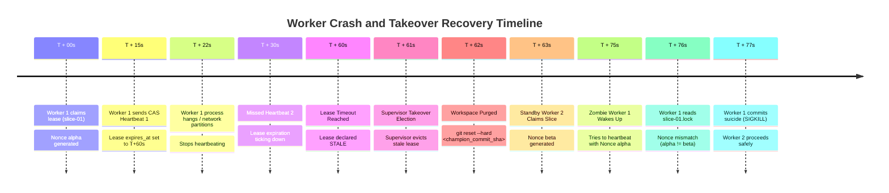
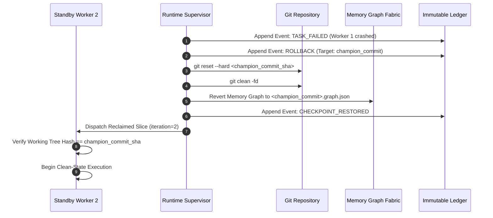

# RFC-0003: Worker Lease Protocol

```yaml
RFC: 0003
Title: Worker Lease Protocol
Status: FOUNDER_FREEZE_RELEASE_CANDIDATE
Author: AGY (Implementation Agent)
Founder: LiplnwZa
Chief Architect: ChatGPT GPT-5
Target: Forge OS Core Governance (v0.2+)
Created: 2026-09-08
Supersedes: docs/architecture/03_RUNTIME_ARCHITECTURE.md (Lease Sections)
Authority: LEVEL 1 (Subordinate to RFC-0000, Peer to RFC-0001)
```

---

## 1. Purpose

This specification establishes the **Worker Lease Protocol** for Forge OS. It provides the mathematical and operational guarantees required for deterministic, single-writer task execution across distributed, asynchronous worker processes. 

The protocol ensures that:
1. No two workers ever concurrently modify the same task slice or working tree (Duplicate Worker Prevention).
2. Lease renewals employ a **Compare-And-Swap (CAS)** protocol to eliminate ABA race conditions and blind overwrites by revived zombie workers.
3. Worker crashes, network partitions, or hanging loops are detected and recovered within deterministic timeouts.
4. Task recovery is completely idempotent, restoring the codebase to the last verified Champion Commit without human intervention.

---

## 2. Scope

1. **In-Scope**:
   - The abstract `LeasePolicy` specification (Kernel invariants vs. Runtime values).
   - Atomic lease acquisition, CAS renewal, release, and takeover election protocols.
   - Fault tolerance: worker crash timelines, network partition recovery, and stale lease eviction.
   - Idempotent checkpoint rollback and recovery sequence.
2. **Out-of-Scope**:
   - Low-level OS thread scheduling and process affinity (managed by host OS).
   - Network socket protocols between distributed cloud nodes (managed by Cloud Runtime).

---

## 3. Definitions

All terms conform to [`GLOSSARY.md`](GLOSSARY.md). Key terms:
- **Worker Lease**: A time-bounded, single-writer lock held by a worker process on a specific task slice.
- **Compare-And-Swap (CAS) Renewal**: Renewal protocol where the worker asserts active `nonce` ownership before extending expiration, preventing blind overwrites.
- **Lease Policy**: The formal configuration object governing heartbeat frequencies, timeouts, and retry limits.
- **Takeover Election**: The automated supervisor protocol reassigning an expired lease from a dead worker to a healthy standby worker.
- **Single-Writer Invariant**: Exactly one worker holds an active write lock on a given slice at any moment.

---

## 4. Invariants

1. **Kernel/Runtime Invariant Boundary**:
   - The **Kernel** defines the invariant bounds (e.g., `heartbeat_interval < lease_timeout`, `retry_budget <= 5`).
   - The **Runtime** supplies the concrete operational values based on deployment topology (local vs. cloud).
2. **Single-Writer Invariant**: A task slice cannot be processed by more than one Builder concurrently. A lease file must exist and be uniquely locked.
3. **CAS Renewal Invariant**: A worker renewing its lease must verify that the active `.lock` file contains its original assigned `nonce`. If the `nonce` differs, the worker must commit immediate suicide (`SIGKILL`).
4. **Hard Deadline Invariant**: Exceeding `max_runtime` triggers non-negotiable process termination (`SIGKILL`) regardless of active heartbeats.
5. **Clean Baseline Invariant**: A worker acquiring a reclaimed or retried slice must unconditionally reset its workspace to the last Champion Commit before executing.

---

## 5. Interfaces & Schemas

### 5.1 The Lease Policy Object

```yaml
lease_policy:
  heartbeat_interval: 15s     # Frequency at which worker must ping the lease file
  lease_timeout: 45s          # Duration of silence after which lease is declared STALE (3x heartbeat)
  max_runtime: 600s           # Absolute monotonic deadline for task completion (10 minutes)
  retry_budget: 5             # Maximum consecutive failures allowed per slice before escalation
  checkpoint_interval: 60s    # Frequency of atomic memory and state flushes to disk
```

#### Invariant Bounds Enforced by Kernel:
- $\text{lease\_timeout} \ge 2 \times \text{heartbeat\_interval}$
- $\text{max\_runtime} \ge 2 \times \text{lease\_timeout}$
- $1 \le \text{retry\_budget} \le 5$

---

### 5.2 Canonical Lease Schema (`.forge/workers/leases/<slice_id>.lock`)

```json
{
  "$schema": "http://json-schema.org/draft-07/schema#",
  "title": "WorkerLeaseRecord",
  "type": "object",
  "required": [
    "slice_id",
    "worker_id",
    "provider_lineage",
    "pid",
    "host_id",
    "acquired_at",
    "last_heartbeat",
    "expires_at",
    "iteration",
    "champion_commit_sha",
    "nonce"
  ],
  "properties": {
    "slice_id": { "type": "string" },
    "worker_id": { "type": "string" },
    "provider_lineage": { "type": "string" },
    "pid": { "type": "integer" },
    "host_id": { "type": "string" },
    "acquired_at": { "type": "string", "format": "date-time" },
    "last_heartbeat": { "type": "string", "format": "date-time" },
    "expires_at": { "type": "string", "format": "date-time" },
    "iteration": { "type": "integer", "minimum": 1, "maximum": 5 },
    "champion_commit_sha": { "type": "string" },
    "nonce": { "type": "string", "description": "Cryptographic random token preventing ABA collision" }
  }
}
```

---

### 5.3 Compare-And-Swap (CAS) Lease Renewal Sequence

To prevent ABA overwrite hazards where a revived zombie process blindly overwrites a reclaimed lock:

```mermaid
sequenceDiagram
    autonumber
    participant W as Worker Process
    participant FS as Local Filesystem (.forge/workers/leases/)
    participant S as Runtime Supervisor

    loop Every heartbeat_interval (15s)
        W->>W: Check Monotonic Deadline (now - acquired_at < max_runtime)
        W->>FS: Read Current Active Lease (<slice_id>.lock)
        alt Current Lease Nonce != Worker Nonce (Evicted / Reclaimed)
            W->>W: ABA Collision Detected!
            W->>W: Terminate Self Immediately (SIGKILL)
        else Current Lease Nonce == Worker Nonce
            W->>FS: Write Updated Payload (<slice_id>.<nonce>.tmp)
            W->>FS: Atomic Swap to (<slice_id>.lock)
            FS-->>W: Swap Succeeded; Lease Extended
        end
    end
```

---

### 5.4 Worker Crash Timeline & Takeover Election



---

### 5.5 Checkpoint Recovery Sequence



---

## 6. Failure Cases & Defenses

| Failure Mode | Root Cause | Protocol Defense |
|---|---|---|
| **Split-Brain Zombie** | Worker hung in external API call wakes up after 60s and tries to write. | CAS Renewal Protocol: Worker detects `nonce` mismatch on `.lock` file and self-terminates (`SIGKILL`). |
| **Network Partition** | Cloud node cut off from central repo. | Local lease timer continues counting; if partitioned $> \text{lease\_timeout}$, local worker self-terminates. |
| **Flapping Worker** | Worker repeatedly crashes after 5 seconds on same code bug. | `retry_budget` exhausted after 5 attempts; slice marked `ESCALATED`, state $\to$ `REPLAN_REQUIRED`. |
| **Clock Skew Attack** | System NTP jump shifts system time by minutes. | Lease expiration evaluated using relative monotonic clocks (`CLOCK_MONOTONIC`) alongside UTC. |

---

## 7. Security Considerations

1. **PID Validation**: Before evicting a lease, the Supervisor must verify that the PID no longer exists or belongs to a different process group, preventing eviction of slow but active workers.
2. **Cryptographic Nonce**: Every lease acquisition generates a 128-bit cryptographic `nonce`. Even if a PID wraps around in the OS, a stale worker cannot renew an expired lease because its nonce is invalidated.

---

## 8. Examples

### Example: Supervisor Evicting Stale Worker Lease
```bash
# Supervisor telemetry log
[SUPERVISOR] Scanning leases at 2026-09-08T02:40:00Z...
[SUPERVISOR] Checking lease: slice-04.lock
[SUPERVISOR] Worker: worker-gpt-02 (PID 14208)
[SUPERVISOR] Last Heartbeat: 2026-09-08T02:38:50Z | Expires At: 2026-09-08T02:39:35Z
[SUPERVISOR] LEASE EXPIRED (overdue by 25s).
[SUPERVISOR] Probing PID 14208: Process not found (ESRCH).
[SUPERVISOR] EVICTING STALE LEASE: slice-04.lock
[SUPERVISOR] Executing: git reset --hard c4b9e1 && git clean -fd
[SUPERVISOR] Requeuing slice-04 to tasks/ready/ (iteration: 2/5)
[SUPERVISOR] Emitted event: TASK_FAILED (worker_crashed) -> .forge/ledger.jsonl
```

---

## 9. Architecture Corrections

1. **Compare-And-Swap (CAS) Lease Renewal**: Eliminated the blind file rename race condition by requiring workers to verify that the active `.lock` holds their assigned `nonce` before extending leases.
2. **Parameterization of Lease Numbers**: Removed hardcoded 15s/45s constants from Kernel code. The Kernel enforces relational invariants, while the Runtime passes concrete `lease_policy` values suited for the host environment.
3. **Hard Monotonic Deadline**: Added `max_runtime` to prevent infinite loop agents from monopolizing tasks while continuing to heartbeat.

---

## 10. References to Related RFCs

- [**RFC-0000: The Forge Constitution**](RFC-0000_FORGE_CONSTITUTION.md) — Law IV (Total Isolation & Ephemeral Lifecycles).
- [**RFC-0006: Project Ledger Protocol**](RFC-0006_PROJECT_LEDGER_PROTOCOL.md) — Records `TASK_ASSIGNED`, `TASK_FAILED`, and `ROLLBACK` events.
- [**RFC-0007: Forge Ratchet Protocol**](RFC-0007_FORGE_RATCHET_PROTOCOL.md) — Governs rollback mechanics upon lease failure.
