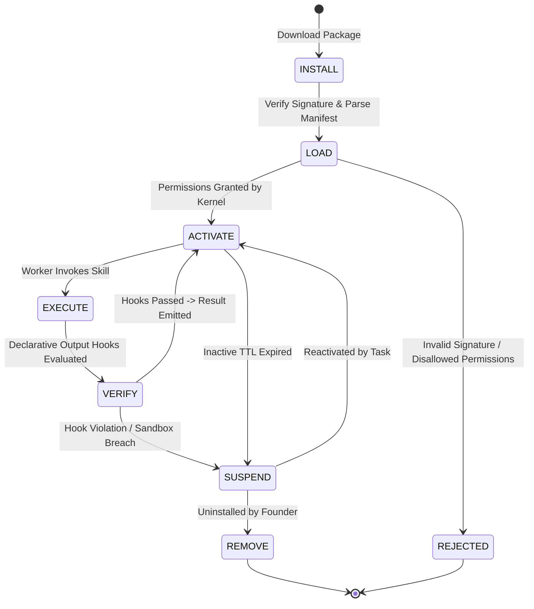

# RFC-0005: Skill Package Specification

```yaml
RFC: 0005
Title: Skill Package Specification
Status: FOUNDER_FREEZE_RELEASE_CANDIDATE
Author: AGY (Implementation Agent)
Founder: LiplnwZa
Chief Architect: ChatGPT GPT-5
Target: Forge OS Core Governance (v0.2+)
Created: 2026-09-08
Supersedes: docs/architecture/14_REPOSITORY_LAYOUT.md (Skill Sections)
Authority: LEVEL 1 (Subordinate to RFC-0000, Peer to RFC-0001)
```

---

## 1. Purpose

This specification establishes the **Skill Package Standard** for Forge OS.

In Forge OS, skills are not arbitrary scripts or ad-hoc prompt snippets. A Skill is a **hermetically isolated, sandboxed computational package**. It encapsulates domain expertise, procedural heuristics, tool interaction protocols, and declarative verification hooks into an installable, verifiable module.

This standard enforces strict sandboxing across four dimensions: **Memory, Storage, Providers, and Network**. Skills operate under the principle of least privilege, ensuring third-party or autonomous skills cannot compromise host integrity, poison long-term memory, or leak credentials on any host platform.

---

## 2. Scope

1. **In-Scope**:
   - Canonical package filesystem layout and manifest schema (`manifest.json`).
   - The seven-stage Skill Lifecycle (`INSTALL` $\to$ `LOAD` $\to$ `ACTIVATE` $\to$ `EXECUTE` $\to$ `VERIFY` $\to$ `SUSPEND` $\to$ `REMOVE`).
   - Universal Sandbox rules across both local developer workstations and cloud nodes: Memory, Storage, Provider, and Network.
   - Declarative verification hooks and `skill_api_version` compatibility.
   - Reference implementation package: `skills/wayfinder/`.
2. **Out-of-Scope**:
   - Web-based public package registry infrastructure (reserved for v1.0).
   - Commercial skill licensing and monetization frameworks.

---

## 3. Definitions

All terms conform to [`GLOSSARY.md`](GLOSSARY.md). Key terms:
- **Skill Package**: A versioned bundle containing `manifest.json`, `SKILL.md`, declarative hooks, and test fixtures.
- **Skill Sandbox**: The multi-dimensional isolation environment confining skill execution across Memory, Storage, Providers, and Network.
- **Verification Hook**: A declarative JSON policy executed before or after a skill invocation to validate inputs and outputs.

---

## 4. Invariants

1. **Zero Ambient Privilege Invariant**: Skills possess zero access to the filesystem, network, or memory by default. All permissions must be explicitly requested in `manifest.json` and validated against the Goal Contract's `approved_scope`.
2. **Universal Network Confinement**: Skills must never possess direct, unmediated socket access on either local developer workstations or cloud runtime environments. All outbound traffic must route through the local Forge OS security proxy.
3. **Declarative Hook Invariant**: Skill hooks must be declarative JSON assertions evaluated by the Runtime engine. Skills are strictly forbidden from executing arbitrary shell scripts in lifecycle hooks.
4. **Memory Isolation Invariant**: Skills may read from designated memory layers ($L_1$ to $L_4$), but can write **only** to ephemeral $L_0$ context. Direct writes to $L_3$ or $L_4$ trigger immediate security revocation.
5. **API Version Compatibility**: A skill specifying `skill_api_version: "1.0.0"` will be rejected if the host Runtime does not satisfy the SemVer range.

---

## 5. Interfaces & Schemas

### 5.1 The Seven-Stage Skill Lifecycle



---

### 5.2 Canonical Manifest Schema (`manifest.json`)

```json
{
  "$schema": "http://json-schema.org/draft-07/schema#",
  "title": "ForgeSkillManifest",
  "type": "object",
  "required": [
    "name",
    "version",
    "skill_api_version",
    "description",
    "required_capabilities",
    "permissions",
    "verification_hooks"
  ],
  "properties": {
    "name": { "type": "string", "pattern": "^[a-z0-9-_]+$" },
    "version": { "type": "string", "pattern": "^[0-9]+\\.[0-9]+\\.[0-9]+$" },
    "skill_api_version": { "type": "string", "enum": ["1.0.0"] },
    "description": { "type": "string" },
    "required_capabilities": {
      "type": "array",
      "items": { "type": "string" },
      "description": "Required worker capabilities (e.g. ['coding:proficient', 'reasoning:expert'])"
    },
    "permissions": {
      "type": "object",
      "required": ["memory", "storage", "providers", "network"],
      "properties": {
        "memory": {
          "type": "object",
          "required": ["read", "write"],
          "properties": {
            "read": { "type": "array", "items": { "type": "string", "enum": ["E0", "L0", "L1", "L2", "L3", "L4"] } },
            "write": { "type": "array", "items": { "type": "string", "enum": ["L0"] } }
          }
        },
        "storage": {
          "type": "object",
          "required": ["read_patterns", "write_patterns"],
          "properties": {
            "read_patterns": { "type": "array", "items": { "type": "string" } },
            "write_patterns": { "type": "array", "items": { "type": "string" } }
          }
        },
        "providers": {
          "type": "object",
          "required": ["allowed_lineages"],
          "properties": {
            "allowed_lineages": { 
              "type": "array", 
              "items": { "type": "string" },
              "description": "Allowed provider lineages, or ['*'] for universal compatibility"
            }
          }
        },
        "network": {
          "type": "object",
          "required": ["allowed_domains"],
          "properties": {
            "allowed_domains": { "type": "array", "items": { "type": "string" } }
          }
        }
      }
    },
    "verification_hooks": {
      "type": "object",
      "required": ["pre_execution", "post_execution"],
      "properties": {
        "pre_execution": { "type": "string", "description": "Relative path to pre-execution JSON hook" },
        "post_execution": { "type": "string", "description": "Relative path to post-execution JSON hook" },
        "audit_hook": { "type": "string" }
      }
    }
  }
}
```

---

### 5.3 Sandbox Isolation Rules

1. **Memory Sandbox**:
   - Skills can read authorized layers declared in `permissions.memory.read`.
   - Skills are physically blocked from mutating $L_1$ to $L_4$. All outputs are emitted to $L_0$ and promoted only upon verified Champion Commits.
2. **Storage Sandbox**:
   - Path confinement enforces that `write_patterns` cannot escape the task's assigned working directory.
   - Symlinks pointing outside the repository root trigger an immediate `SECURITY_VIOLATION`.
3. **Provider Sandbox**:
   - A skill can declare affinity or incompatibility with specific model lineages via `permissions.providers.allowed_lineages`. The literal token `"*"` designates universal compatibility.
4. **Universal Network Sandbox**:
   - Skills have **zero direct ambient network access** across all runtime environments (Windows, macOS, Linux, and Cloud VPS).
   - In local and cloud environments alike, worker processes execute inside sandboxed network boundaries (OS network namespaces, firewall redirection, or loopback-only environment variables `HTTP_PROXY=127.0.0.1:<port>`), ensuring all external HTTP/HTTPS traffic is mediated and whitelisted against `permissions.network.allowed_domains`.

---

## 6. Failure Cases

1. **Arbitrary Shell Execution Attempt**: A skill author attempts to include a shell script in `hooks/post_execution.sh`.  
   *Defense*: Manifest parser strictly rejects non-`.json` hook files during the `LOAD` phase.
2. **Path Traversal Escape**: Skill emits a write targeting `../../etc/passwd`.  
   *Defense*: Storage sandbox normalizes all paths via `filepath.Clean` and verifies prefix against project root; operation aborted.
3. **Local Workstation Network Exfiltration**: Compromised skill opens a raw TCP socket to an external IP.  
   *Defense*: Local OS network boundary blocks non-proxy egress; socket call receives `ECONNREFUSED`.

---

## 7. Security Considerations

1. **Cryptographic Package Signing**: Production skills must include `signatures/package.sig` verified against the Founder's trusted public keys ([RFC-0010](RFC-0010_TRUST_AND_PROVENANCE_PROTOCOL.md)).
2. **Static AST Analysis**: Before `LOAD`, the skill's example code and prompt templates undergo static AST scanning for prompt injection patterns.

---

## 8. Complete Reference Example: `skills/wayfinder/`

### A. Directory Structure
```
skills/wayfinder/
├── manifest.json
├── SKILL.md
├── references/
│   └── decomposition_patterns.md
├── hooks/
│   ├── pre_execution.json
│   └── post_execution.json
└── tests/
    └── decomposition_test.json
```

### B. `skills/wayfinder/manifest.json`
```json
{
  "name": "wayfinder",
  "version": "1.0.0",
  "skill_api_version": "1.0.0",
  "description": "Autonomous architectural exploration, DAG dependency decomposition, and unknown elimination.",
  "required_capabilities": [
    "planning:expert",
    "reasoning:expert"
  ],
  "permissions": {
    "memory": {
      "read": ["L1", "L3", "L4"],
      "write": ["L0"]
    },
    "storage": {
      "read_patterns": ["docs/**", ".forge/goal_contract.json", ".forge/state.json"],
      "write_patterns": [".forge/tasks/ready/**"]
    },
    "providers": {
      "allowed_lineages": ["*"]
    },
    "network": {
      "allowed_domains": []
    }
  },
  "verification_hooks": {
    "pre_execution": "hooks/pre_execution.json",
    "post_execution": "hooks/post_execution.json"
  }
}
```

### C. `skills/wayfinder/hooks/post_execution.json` (Declarative Validation)
```json
{
  "hook_version": "1.0.0",
  "assertions": [
    {
      "target": "output.tasks",
      "rule": "ARRAY_NOT_EMPTY"
    },
    {
      "target": "output.tasks[*].estimated_lines",
      "rule": "LESS_THAN_OR_EQUAL",
      "value": 100
    },
    {
      "target": "output.tasks[*].dependencies",
      "rule": "IS_DAG_ACYCLIC"
    }
  ]
}
```

---

## 9. Architecture Corrections

1. **Closed Local Workstation Network Escape**: Eliminated the "cloud only" qualification; mandated universal loopback proxy confinement across all local OS workstations.
2. **Standardized Provider Lineage Wildcard**: Formally documented that `"allowed_lineages": ["*"]` denotes universal model compatibility.
3. **Corrected Hierarchy Reference**: Clarified that Skills operate at Level 4 of the Constitutional Authority Hierarchy under RFC-0000.

---

## 10. References to Related RFCs

- [**RFC-0000: The Forge Constitution**](RFC-0000_FORGE_CONSTITUTION.md) — Level 4 of Authority Hierarchy.
- [**RFC-0002: Memory Graph Protocol**](RFC-0002_MEMORY_GRAPH_PROTOCOL.md) — Governs skill access to memory layers ($L_0$–$L_4$).
- [**RFC-0004: Provider Capability Matrix**](RFC-0004_PROVIDER_CAPABILITY_MATRIX.md) — Matches required capabilities with candidate workers.
- [**RFC-0009: Scope Shield Protocol**](RFC-0009_SCOPE_SHIELD_PROTOCOL.md) — Enforces storage whitelist boundaries.
- [**RFC-0010: Trust and Provenance Protocol**](RFC-0010_TRUST_AND_PROVENANCE_PROTOCOL.md) — Cryptographic package signing and attestation.
