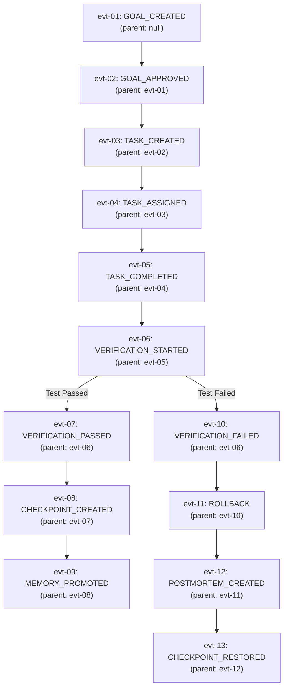

# RFC-0006: Project Ledger Protocol

```yaml
RFC: 0006
Title: Project Ledger Protocol
Status: FOUNDER_FREEZE_RELEASE_CANDIDATE
Author: AGY (Implementation Agent)
Founder: LiplnwZa
Chief Architect: ChatGPT GPT-5
Target: Forge OS Core Governance (v0.2+)
Created: 2026-09-08
Supersedes: docs/architecture/10_PROJECT_LEDGER.md
Authority: LEVEL 1 (Subordinate to RFC-0000, Peer to RFC-0001)
```

---

## 1. Purpose

This specification establishes the **Project Ledger Protocol** for Forge OS.

The Project Ledger serves as the immutable **audit backbone and event sourcing foundation** of the operating system. Operating within `.forge/ledger.jsonl`, the Ledger records every state transition, goal modification, worker lease assignment, verification verdict, memory promotion, and human override.

By structuring events as an explicit **Causal Directed Acyclic Graph (DAG)** linked via `parent_event_id`, the Ledger guarantees non-repudiation, deterministic crash replay, and transparent auditability: **no action exists in the reality of Forge OS unless it is witnessed and permanently recorded in the Ledger**.

---

## 2. Scope

1. **In-Scope**:
   - The append-only `.forge/ledger.jsonl` event stream format and serialization schema.
   - The 17 canonical lifecycle event definitions, including `GOAL_AMENDED`.
   - Causal DAG event ordering via `parent_event_id`.
   - Non-overwrite, non-deletion, and forward-compensating rollback rules.
   - Correlation tracking via `goal_hash`, `task_id`, `evidence_refs`, and `decision_refs`.
2. **Out-of-Scope**:
   - Long-term cold archive indexing and analytics databases (DuckDB/BigQuery sync).
   - Distributed consensus across Byzantine distributed ledgers (Forge OS uses a centralized local event log backed by Git).

---

## 3. Definitions

All terms conform to [`GLOSSARY.md`](GLOSSARY.md). Key terms:
- **Event Sourcing**: Architectural pattern where state is derived by sequentially replaying an append-only log of immutable events.
- **Causal Event DAG**: The graph formed by events pointing to their immediate causal predecessor via `parent_event_id`.
- **Compensating Event**: An event that reverses the operational effect of a prior event without mutating past history (e.g., `ROLLBACK`).
- **Audit Backbone**: The unbroken chain of events verifying compliance with the Forge Constitution.

---

## 4. Invariants

1. **Append-Only Invariant**: The Ledger is strictly append-only. Modifying, truncating, deleting, or reordering existing lines in `.forge/ledger.jsonl` is a Constitutional Violation (Code V-04).
2. **Causal DAG Invariant**: Every event except the root (`GOAL_CREATED`) must declare a valid `parent_event_id` referencing an existing event in the active branch of the DAG.
3. **Forward Compensation Invariant**: A rollback or failed operation never deletes past records. A rollback must be recorded as a discrete new event (`ROLLBACK`) referencing the target Champion Commit.
4. **Cryptographic Causality Invariant**: Every event must include the active `goal_hash` and reference preceding causal decisions or evidence IDs.
5. **Atomic Flush Invariant**: Ledger entries must be flushed and fsynced to disk prior to the emission of downstream state notifications.

---

## 5. Interfaces & Schemas

### 5.1 The Causal Event DAG Structure



---

### 5.2 The 17 Canonical Ledger Events

| Event Type | Emitted By | Description & Semantic Trigger |
|---|---|---|
| `GOAL_CREATED` | Kernel / Grill | Emitted when a new user idea is formalized into a draft contract. |
| `GOAL_APPROVED` | Kernel / Approval | Emitted when the Founder provides a valid cryptographic signature. |
| `GOAL_AMENDED` | Kernel / Approval | Emitted when the Founder signs an authorized goal amendment. |
| `TASK_CREATED` | Scheduler | Emitted when an atomic task slice ($\le 100$ lines) is queued in `tasks/ready/`. |
| `TASK_ASSIGNED` | Scheduler / Lease | Emitted when a worker acquires a lease lock on a slice. |
| `TASK_COMPLETED` | Worker / Builder | Emitted when a Builder submits code diffs for verification. |
| `TASK_FAILED` | Worker / Lease | Emitted when a worker crashes, timeouts, or self-reports failure. |
| `VERIFICATION_STARTED`| Critic Worker | Emitted when an isolated Critic begins adversarial compilation/tests ($V_0$–$V_5$). |
| `VERIFICATION_PASSED` | Critic / Kernel | Emitted when all tests exit $0$ and physical proofs satisfy criteria. |
| `VERIFICATION_FAILED` | Critic / Kernel | Emitted when compilation fails, tests fail, or size exceeds 100 lines. |
| `FOUNDER_OVERRIDE` | Founder Interface | Emitted when the Founder triggers break-glass or changes state manually. |
| `ROLLBACK` | Runtime Supervisor| Emitted when workspace is reset to last Champion Commit. |
| `CHECKPOINT_CREATED` | Storage Layer | Emitted when Memory Graph and Git commit are atomically snapshotted. |
| `CHECKPOINT_RESTORED`| Storage Layer | Emitted when Memory Graph is restored from a prior snapshot SHA. |
| `MEMORY_PROMOTED` | Memory Engine | Emitted when an $E_0/L_0$ node advances to $L_1, L_2, L_3,$ or $L_4$. |
| `PATTERN_CREATED` | Memory Engine | Emitted when a reusable code template is indexed into $L_2$ Skill Memory. |
| `POSTMORTEM_CREATED` | Debug Circuit | Emitted when an RCA node is sealed into $L_4$ Experience Memory. |

---

### 5.3 Canonical Event Schema (`ledger.jsonl`)

Every line in `.forge/ledger.jsonl` must be a valid, single-line JSON object matching this schema:

```json
{
  "$schema": "http://json-schema.org/draft-07/schema#",
  "title": "ForgeLedgerEvent",
  "type": "object",
  "required": [
    "event_id",
    "parent_event_id",
    "timestamp",
    "event_type",
    "actor",
    "goal_hash",
    "payload"
  ],
  "properties": {
    "event_id": { "type": "string", "pattern": "^evt-[a-f0-9]{16}$" },
    "parent_event_id": { "type": ["string", "null"], "description": "Pointer to preceding causal event (null only for root GOAL_CREATED)" },
    "timestamp": { "type": "string", "format": "date-time" },
    "event_type": {
      "type": "string",
      "enum": [
        "GOAL_CREATED",
        "GOAL_APPROVED",
        "GOAL_AMENDED",
        "TASK_CREATED",
        "TASK_ASSIGNED",
        "TASK_COMPLETED",
        "TASK_FAILED",
        "VERIFICATION_STARTED",
        "VERIFICATION_PASSED",
        "VERIFICATION_FAILED",
        "FOUNDER_OVERRIDE",
        "ROLLBACK",
        "CHECKPOINT_CREATED",
        "CHECKPOINT_RESTORED",
        "MEMORY_PROMOTED",
        "PATTERN_CREATED",
        "POSTMORTEM_CREATED"
      ]
    },
    "actor": {
      "type": "object",
      "required": ["type", "id"],
      "properties": {
        "type": { "type": "string", "enum": ["FOUNDER", "KERNEL", "RUNTIME", "WORKER"] },
        "id": { "type": "string" },
        "provider": { "type": "string" },
        "lineage": { "type": "string" }
      }
    },
    "goal_hash": { "type": "string" },
    "task_id": { "type": ["string", "null"] },
    "artifact_refs": { "type": "array", "items": { "type": "string" } },
    "evidence_refs": { "type": "array", "items": { "type": "string" } },
    "decision_refs": { "type": "array", "items": { "type": "string" } },
    "payload": { "type": "object" }
  }
}
```

---

## 6. Failure Cases

1. **Mid-Stream Truncation / Disk Full**: Power failure occurs while writing a ledger entry.  
   *Defense*: Append operations write to a write-ahead buffer; on boot, the Ledger scanner truncates partial trailing lines and asserts CRC32 checksum validity.
2. **Broken Causality Pointer**: An event declares a `parent_event_id` that does not exist in the ledger.  
   *Defense*: The Runtime Supervisor asserts topological consistency before appending; broken parent pointers throw `CausalIntegrityException`.
3. **Malicious Tampering by Compromised Agent**: An agent modifies a historical `VERIFICATION_FAILED` event to `PASSED`.  
   *Defense*: Git tree tracks `ledger.jsonl`; git log proves unauthorized modification; Scope Shield trips and halts the OS.

---

## 7. Security Considerations

1. **Redaction Pipeline**: All text payloads, stack traces, and tool outputs passed into ledger events must transit the security regex sanitizer to scrub API keys, passwords, and private tokens.
2. **Immutable Audit Trail**: Because the ledger is tracked in the Git repository, any retroactive modification of history alters Git commit hashes, immediately exposing tampering.

---

## 8. Examples

### Example: Goal Amendment Event Chain
```json
{"event_id":"evt-0191a2b3c4d5e6f1","parent_event_id":"evt-0191a2b3c4d5e6f0","timestamp":"2026-09-08T02:40:00Z","event_type":"GOAL_AMENDED","actor":{"type":"FOUNDER","id":"founder-liplnwza"},"goal_hash":"9f83b2a1c0...","task_id":null,"artifact_refs":[],"evidence_refs":[],"decision_refs":["dec-009"],"payload":{"amendment_id":"amend-01","prior_goal_hash":"1c3d8ff2b...","new_ratchet_version":6,"approved_at":"2026-09-08T02:40:00Z"}}
```

---

## 9. Architecture Corrections

1. **Added Canonical `GOAL_AMENDED` Event**: Resolved the critical contradiction between RFC-0000/0001 and RFC-0006 by adding `GOAL_AMENDED` to the event catalog and JSON schema.
2. **Causal Event DAG via `parent_event_id`**: Added mandatory causal parent linking to resolve clock jitter and prove deterministic event ordering.
3. **Updated Canonical Event Count**: Reconciled the ledger inventory to 17 formal event types across all system documentation.

---

## 10. References to Related RFCs

- [**RFC-0000: The Forge Constitution**](RFC-0000_FORGE_CONSTITUTION.md) — Article IV and Violation V-04 (Ledger Mutation).
- [**RFC-0001: The Kernel Contract**](RFC-0001_KERNEL_CONTRACT.md) — Validates events triggering state machine transitions.
- [**RFC-0007: Forge Ratchet Protocol**](RFC-0007_FORGE_RATCHET_PROTOCOL.md) — Requires ledger events for every ratchet advancement.
- [**RFC-0010: Trust and Provenance Protocol**](RFC-0010_TRUST_AND_PROVENANCE_PROTOCOL.md) — Cryptographic event attestation.
