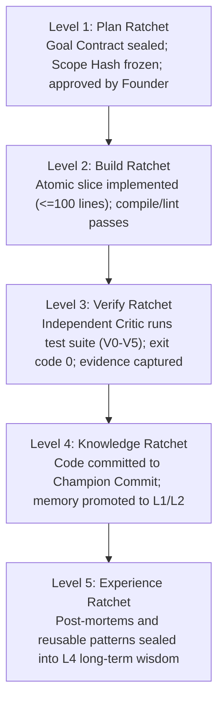
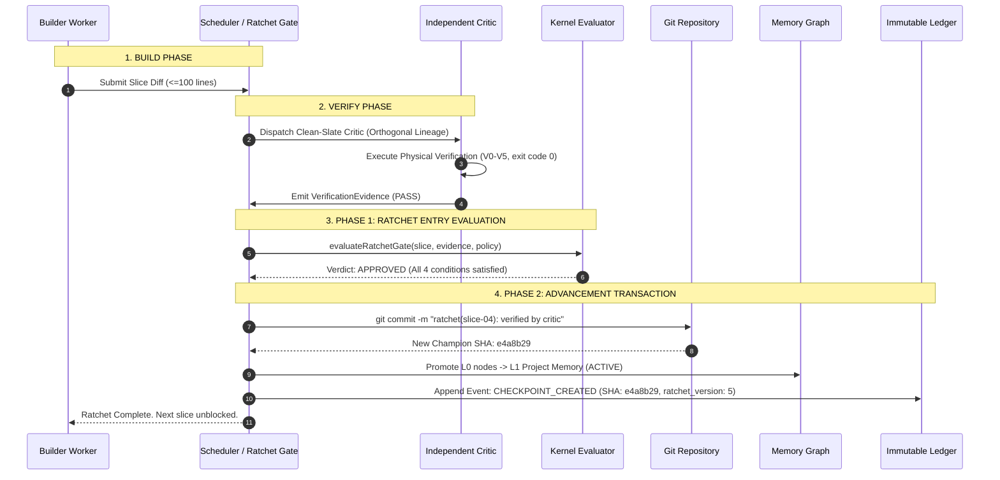
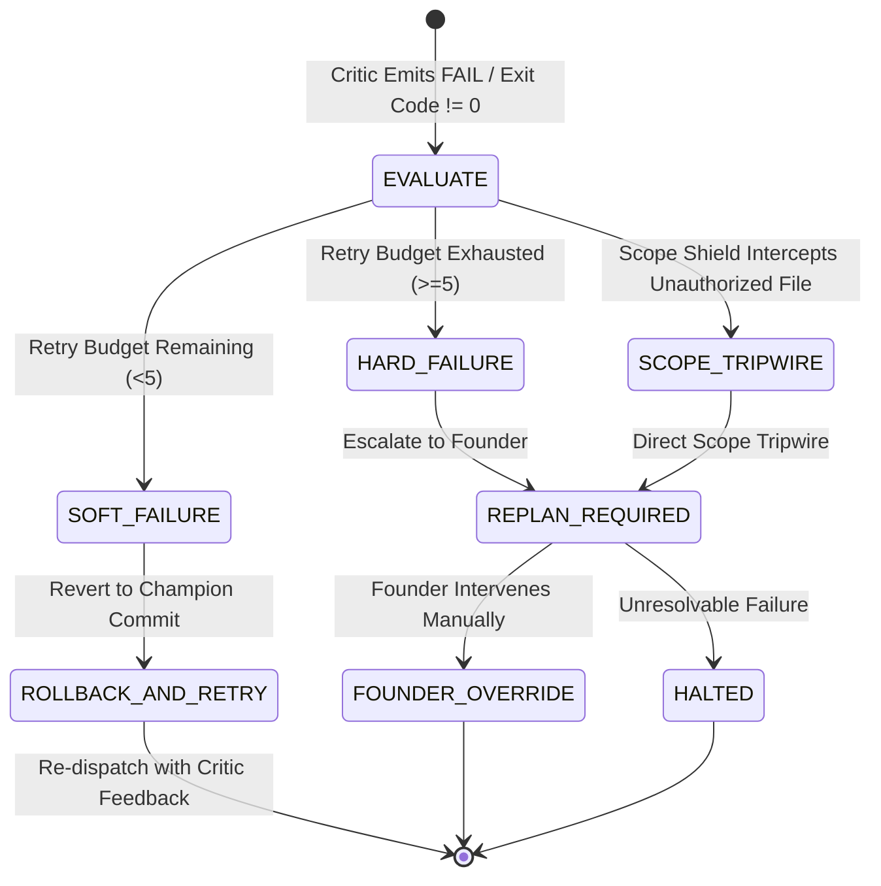

# RFC-0007: Forge Ratchet Protocol

```yaml
RFC: 0007
Title: Forge Ratchet Protocol
Status: FOUNDER_FREEZE_RELEASE_CANDIDATE
Author: AGY (Implementation Agent)
Founder: LiplnwZa
Chief Architect: ChatGPT GPT-5
Target: Forge OS Core Governance (v0.2+)
Created: 2026-09-08
Supersedes: docs/architecture/06_SCHEDULER.md (Ratchet Sections)
Authority: LEVEL 1 (Subordinate to RFC-0000, Peer to RFC-0001)
```

---

## 1. Purpose

This specification establishes the **Forge Ratchet Protocol**.

The Ratchet represents Forge OS's core execution philosophy: **Truth only moves forward through verified physical evidence**. In unconstrained multi-agent architectures, errors compound: one hallucinated function induces three speculative patches, culminating in project collapse. 

The Forge Ratchet functions as a mechanical pawl: work is broken into granular, discrete teeth ($\le 100$ lines). The system advances to the next tooth if and only if independent, physical verification succeeds. If a defect, regression, or critic rejection occurs, the pawl holds the baseline: unverified changes are discarded instantly, and the system snaps back to the last certified **Champion Commit**.

---

## 2. Scope

1. **In-Scope**:
   - The fundamental Ratchet Principle and two-phase Ratchet Gate architecture (Entry Condition vs. Advancement Transaction).
   - The five Ratchet Levels: Plan, Build, Verify ($V_0$–$V_5$), Knowledge, and Experience.
   - Ratchet Failure handling: Soft Failure, Hard Failure, Scope Shield Tripwire, and Founder Override.
   - Non-destructive rollback protocols and Git-synchronized checkpointing.
2. **Out-of-Scope**:
   - Underlying VCS implementation (Forge OS uses Git as its reference engine, but the protocol is VCS-agnostic).

---

## 3. Definitions

All terms conform to [`GLOSSARY.md`](GLOSSARY.md). Key terms:
- **Ratchet**: A unidirectional mechanism that allows progress only when certified by evidence, preventing backward slippage into corrupted state.
- **Champion Commit**: The most recent Git commit that successfully cleared all verification gates.
- **Verification Levels ($V_0$ to $V_5$)**: Standardized strictness tiers ($V_0$ Syntax, $V_1$ Compile, $V_2$ Unit, $V_3$ Integration, $V_4$ Invariant, $V_5$ Outsider).
- **Soft Failure**: A critic rejection where the slice can be retried within the remaining slice retry budget ($< 5$).
- **Hard Failure**: A persistent failure exhausting the retry budget or violating constitutional invariants, forcing replanning.

---

## 4. Invariants

1. **No State Promotion Without Physical Evidence**: Natural language declarations of success have zero evidential weight. Promotion requires reproducible exit codes, AST proofs, or test reports ($V_0$–$V_5$).
2. **Slice Granularity Limit**: Any task slice modifying more than 100 contiguous lines ($\text{LinesAdded} + \text{LinesDeleted} > 100$) is blocked by the Ratchet Gate before dispatch.
3. **Rollback Non-Destructiveness**: A rollback reverts working files to the Champion Commit, but never deletes failure history from the Ledger or Post-Mortem Graph.
4. **Monotonic Ratchet Versioning**: The `ratchet_version` counter increments strictly upon successful Champion Commits and never decrements.

---

## 5. Interfaces & Schemas

### 5.1 The Five Ratchet Levels



---

### 5.2 The Two-Phase Ratchet Gate Architecture

To eliminate precondition circular deadlocks while preserving absolute verification rigor, the Ratchet Gate operates in two distinct, sequential phases:

#### Phase 1: The Ratchet Entry Condition
Evaluated purely and synchronously before any state modification is permitted:
$$\text{CanRatchet} = \text{PhysicalEvidenceValid}(V_n) \land \text{CriticCertified} \land \text{ScopeConfinementPassed} \land \text{SizeWithinLimit}(\le 100)$$

#### Phase 2: The Ratchet Advancement Transaction
Executed in strict atomic sequence upon a positive Entry Condition verdict:
$$\text{RatchetTransaction} = \text{AtomicCommit} \longrightarrow \text{MemoryPromotion}(L_0 \to L_1) \longrightarrow \text{LedgerCheckpoint}$$



---

### 5.3 Ratchet Failure Handling: Four Modes



1. **Soft Failure**: A test fails ($V_1$–$V_4$) within the retry budget. Workspace reverts to Champion Commit (`git reset --hard champion_commit`), the iteration counter increments, and the slice is retried.
2. **Hard Failure**: A slice fails 5 consecutive iterations. The slice is marked `ESCALATED`, triggering an immediate transition to `REPLAN_REQUIRED`.
3. **Scope Shield Tripwire**: Builder touches an unapproved file. Intercepted by [RFC-0009](RFC-0009_SCOPE_SHIELD_PROTOCOL.md); state transitions from `EXECUTING` directly to `REPLAN_REQUIRED`.
4. **Founder Override**: The Founder issues a signed directive amending the contract or authorizing an exception.

---

## 6. Failure Cases

1. **Phantom Ratchet (Unverified Commit)**: Runtime attempts to commit code without an attached critic evidence ID.  
   *Defense*: Git pre-commit hook queries Kernel; commit aborted if evidence token is absent.
2. **Precondition Deadlock**: Gate evaluation blocked waiting for memory promotion.  
   *Defense*: Two-phase gate architecture evaluates entry conditions before executing promotion in Phase 2.
3. **Memory Desynchronization on Rollback**: Workspace reverts, but memory retains uncommitted functions.  
   *Defense*: Memory Checkpoint Protocol: Graph reverts atomically to the checkpoint bound to the Champion Commit SHA.

---

## 7. Security Considerations

1. **Adversarial Test Tampering**: A rogue builder modifies existing tests to return `true`.  
   *Defense*: Critic runs in clean-slate container and verifies that existing test files were not modified unless explicitly authorized in `approved_scope` ([RFC-0009](RFC-0009_SCOPE_SHIELD_PROTOCOL.md)).
2. **AST Diff Verification**: Diff line counting is performed by AST/source line analysis, preventing deceptive whitespace formatting from masking large changes.

---

## 8. Examples

### Example: Ratchet Gate Evaluation Output
```json
{
  "slice_id": "slice-07",
  "ratchet_version": 12,
  "lines_changed": 64,
  "entry_evaluation": {
    "size_within_limit": true,
    "scope_confinement_passed": true,
    "critic_orthogonality_verified": true,
    "verification_level_achieved": "V2_UNIT",
    "physical_exit_code": 0,
    "evidence_hash": "a1b2c3d4e5f67890..."
  },
  "verdict": "RATCHET_APPROVED",
  "advancement_transaction": {
    "champion_commit_sha": "f891a2b",
    "promoted_nodes": ["mem-abc123456789"],
    "checkpoint_event_id": "evt-0191a2b3c4d5e6fa"
  }
}
```

---

## 9. Architecture Corrections

1. **Resolved Precondition Deadlock**: Split Ratchet Gate into two distinct phases (Phase 1 Entry Condition vs. Phase 2 Advancement Transaction), eliminating the circular dependency with memory promotion.
2. **Verification Level Renaming (V0–V5)**: Updated strictness tiers to `V0_SYNTAX` through `V5_OUTSIDER`, eliminating ambiguity with Memory Layers $L_0$–$L_4$.
3. **Integrated Scope Shield Tripwire**: Formalized direct transition from `EXECUTING` to `REPLAN_REQUIRED` upon Scope Shield interception.

---

## 10. References to Related RFCs

- [**RFC-0000: The Forge Constitution**](RFC-0000_FORGE_CONSTITUTION.md) — Law III (The Ratchet Principle).
- [**RFC-0001: The Kernel Contract**](RFC-0001_KERNEL_CONTRACT.md) — Implements `evaluateRatchetGate`.
- [**RFC-0002: Memory Graph Protocol**](RFC-0002_MEMORY_GRAPH_PROTOCOL.md) — Governs memory promotion during Phase 2.
- [**RFC-0006: Project Ledger Protocol**](RFC-0006_PROJECT_LEDGER_PROTOCOL.md) — Records `CHECKPOINT_CREATED` and `ROLLBACK` events.
- [**RFC-0009: Scope Shield Protocol**](RFC-0009_SCOPE_SHIELD_PROTOCOL.md) — Intercepts out-of-scope modifications.
- [**RFC-0010: Trust and Provenance Protocol**](RFC-0010_TRUST_AND_PROVENANCE_PROTOCOL.md) — Physical evidence cryptographic verification.
