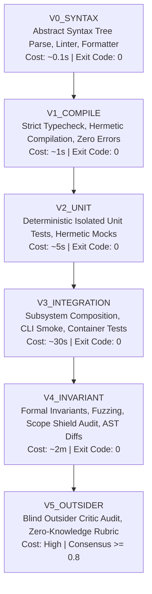
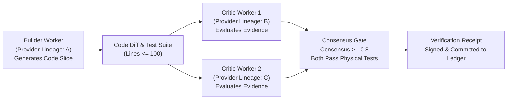

# RFC-0008: Verification Contract Protocol

```yaml
RFC: 0008
Title: Verification Contract Protocol
Status: FOUNDER_FREEZE_RELEASE_CANDIDATE
Author: AGY (Implementation Agent)
Founder: LiplnwZa
Chief Architect: ChatGPT GPT-5
Target: Forge OS Core Verification & Quality Assurance (v0.3+)
Created: 2026-09-08
Supersedes: None
Authority: LEVEL 1 (Protocol Specification)
verification_standard: V0_THROUGH_V5
```

---

## 1. Purpose

This specification defines the canonical **Verification Contract Protocol** for **Forge OS**. Under Non-Derogable Constitutional Law IV (*Empirical Verification Precedence*, [RFC-0000](RFC-0000_FORGE_CONSTITUTION.md)), no autonomous task slice, planning proposal, architectural migration, or code commit may cross the Forge Ratchet without concrete, non-hallucinated, machine-verifiable physical evidence.

This protocol operationalizes empirical verification by establishing:
1. The machine-readable **Verification Contract Schema**.
2. The canonical **$V_0$ to $V_5$ Verification Levels** hierarchy.
3. Strict **Evidence Requirements** and immutable **Verification Receipts**.
4. Orthogonal **Critic Requirements** and cryptographic attestations.
5. Absolute **Human Verification Rules** and escalation boundaries.
6. Deterministic **Timeout and Retry Policies** with flaky test quarantine.
7. Declarative **Project-Specific Verification Contracts**.

---

## 2. Scope

1. **Lifecycle Coverage**: Binds all verification activities across the Forge OS deterministic lifecycle ([RFC-0001](RFC-0001_KERNEL_CONTRACT.md)): during `PLANNING` (adversarial plan verification), `BUILD` (atomic slice verification), `VERIFYING` (full test suite execution), `SCRUTINIZING` (independent critic audit), and `DONE` (founder acceptance).
2. **Actor Confinement**: Binds all Builders, Critics, Outsiders, the Task Scheduler, and the Kernel Policy Engine.
3. **Subordination**: Derived from Level 0 Constitution ([RFC-0000](RFC-0000_FORGE_CONSTITUTION.md)). Integrates directly with the Kernel Contract ([RFC-0001](RFC-0001_KERNEL_CONTRACT.md)), Memory Graph ([RFC-0002](RFC-0002_MEMORY_GRAPH_PROTOCOL.md)), Project Ledger ([RFC-0006](RFC-0006_PROJECT_LEDGER_PROTOCOL.md)), Forge Ratchet ([RFC-0007](RFC-0007_FORGE_RATCHET_PROTOCOL.md)), and Trust Protocol ([RFC-0010](RFC-0010_TRUST_AND_PROVENANCE_PROTOCOL.md)).

---

## 3. Definitions

All terms conform to the [Forge OS Glossary](GLOSSARY.md). Key terms in this specification include:
- **Verification Contract**: A machine-readable, cryptographically sealed specification detailing commands, constraints, timeouts, required levels, and critic rubrics necessary to prove an artifact's correctness.
- **Verification Level ($V_0$–$V_5$)**: A strict, ordinal tier of physical verification rigor, progressing monotonically from static syntax checks to zero-knowledge outsider audits.
- **Physical Evidence**: Deterministic, machine-generated outputs produced by tool execution (e.g., exit code 0, AST parse trees, JSON test reports, compiler stderr logs, coverage bitmaps). Natural language self-attestations carry zero evidential value.
- **Verification Receipt**: An immutable, signed data structure recording the execution outputs, duration, exit code, stdout/stderr cryptographic hashes, and critic endorsements of a verification pass.
- **Critic**: An autonomous evaluation agent operating under strict lineage orthogonality from the Builder that produced the code under test.
- **Outsider Critic**: An evaluation agent possessing zero prior context from earlier slices, evaluated under clean-slate conditions.
- **Flaky Test**: A test whose outcome is non-deterministic under identical code commits and environment configurations.

---

## 4. Invariants

1. **Zero Self-Certification Invariant**: A Builder worker can never serve as the Critic for its own task slice or artifact. Critic lineage must be strictly orthogonal to Builder lineage.
2. **Physical Evidence Precedence**: No cognitive model's text assertion ("The tests passed successfully") can substitute for concrete subprocess execution artifacts. Advancement requires exit code 0 and matched stdout/stderr SHA-256 hashes.
3. **Monotonic Level Ordering**: Verification at level $V_k$ strictly requires that all lower levels $V_0, V_1, \dots, V_{k-1}$ have executed and passed within the current verification transaction.
4. **Deterministic Timeout Invariant**: Every verification command must be executed with a hard, monotonic timeout. Any execution exceeding its deadline is forcefully killed (`SIGKILL`), treated as a hard failure, and prohibited from retrying indefinitely.
5. **Receipt Immutability**: Verification receipts committed to the Project Ledger ([RFC-0006](RFC-0006_PROJECT_LEDGER_PROTOCOL.md)) are immutable. Retries generate new receipt nodes linked via `parent_event_id` in the causal DAG.
6. **Project Rigor Floor**: A project-specific verification contract may increase verification stringency (e.g., mandating $V_4$ for all slices), but may **never** weaken or reduce requirements below the baseline set in the Goal Contract.

---

## 5. Interfaces & Schemas

### 5.1 The Verification Hierarchy ($V_0$ to $V_5$)

Verification rigor is stratified into six strictly ordered levels:



| Level | Identifier | Objective | Primary Tooling / Mechanism | Mandatory Evidence |
|---|---|---|---|---|
| **$V_0$** | `V0_SYNTAX` | Syntax validity & static cleanliness | AST parsers, linters (`eslint`, `ruff`, `biome`) | AST parse tree, 0 linter violations, exit code 0 |
| **$V_1$** | `V1_COMPILE` | Type safety & compilation correctness | Compilers (`tsc --noEmit`, `cargo check`, `go vet`) | Clean compilation stream, 0 type errors, exit code 0 |
| **$V_2$** | `V2_UNIT` | Logic correctness in isolated modules | Unit test runners (`vitest run`, `pytest -m unit`) | TAP/JUnit XML report, 100% pass, coverage bitmap |
| **$V_3$** | `V3_INTEGRATION` | Cross-module composition & wiring | Integration suites (`vitest -m integration`, docker) | Container exit code 0, smoke logs, socket teardown |
| **$V_4$** | `V4_INVARIANT` | Security boundaries & structural invariants | Scope Shield AST audit, property fuzzers, leak scans | Confinement audit proof, 0 secret leaks, fuzz pass |
| **$V_5$** | `V5_OUTSIDER` | Multi-provider architectural scrutiny | Clean-slate Outsider Critic (disjoint lineage) | Signed `CriticAttestation` with consensus score $\ge 0.8$ |

---

### 5.2 Verification Contract Schema

Every task slice and Goal Contract declares its verification requirements via this canonical schema:

```json
{
  "$schema": "https://json-schema.org/draft/2020-12/schema",
  "title": "VerificationContract",
  "type": "object",
  "required": [
    "contract_id",
    "schema_version",
    "goal_id",
    "min_verification_level",
    "level_definitions",
    "critic_policy",
    "timeout_policy",
    "created_at"
  ],
  "properties": {
    "contract_id": { "type": "string", "format": "uuid" },
    "schema_version": { "type": "string", "enum": ["1.0.0"] },
    "goal_id": { "type": "string" },
    "slice_id": { "type": ["string", "null"] },
    "min_verification_level": {
      "type": "string",
      "enum": ["V0_SYNTAX", "V1_COMPILE", "V2_UNIT", "V3_INTEGRATION", "V4_INVARIANT", "V5_OUTSIDER"]
    },
    "level_definitions": {
      "type": "object",
      "required": ["V0_SYNTAX"],
      "additionalProperties": {
        "type": "object",
        "required": ["commands", "working_dir", "timeout_ms"],
        "properties": {
          "commands": {
            "type": "array",
            "items": { "type": "string" }
          },
          "working_dir": { "type": "string" },
          "env": {
            "type": "object",
            "additionalProperties": { "type": "string" }
          },
          "timeout_ms": { "type": "integer", "minimum": 1000 },
          "allow_network": { "type": "boolean", "default": false }
        }
      }
    },
    "critic_policy": {
      "type": "object",
      "required": ["min_critics", "require_lineage_orthogonality", "consensus_threshold"],
      "properties": {
        "min_critics": { "type": "integer", "minimum": 1, "default": 1 },
        "require_lineage_orthogonality": { "type": "boolean", "default": true },
        "consensus_threshold": { "type": "number", "minimum": 0.5, "maximum": 1.0, "default": 0.8 },
        "rubric_id": { "type": "string" }
      }
    },
    "human_gate": {
      "type": "object",
      "required": ["required_for_advancement", "escalation_conditions"],
      "properties": {
        "required_for_advancement": { "type": "boolean", "default": false },
        "escalation_conditions": {
          "type": "array",
          "items": { "type": "string" }
        }
      }
    },
    "timeout_policy": {
      "type": "object",
      "required": ["max_retries_per_slice", "flaky_test_threshold", "backoff_multiplier"],
      "properties": {
        "max_retries_per_slice": { "type": "integer", "minimum": 0, "maximum": 5, "default": 3 },
        "flaky_test_threshold": { "type": "integer", "minimum": 2, "default": 2 },
        "backoff_multiplier": { "type": "number", "minimum": 1.0, "default": 1.5 }
      }
    },
    "created_at": { "type": "string", "format": "date-time" }
  }
}
```

---

### 5.3 Evidence Requirements & Verification Receipt Schema

When a verification command executes, physical evidence is gathered into an immutable **Verification Receipt**:

```json
{
  "$schema": "https://json-schema.org/draft/2020-12/schema",
  "title": "VerificationReceipt",
  "type": "object",
  "required": [
    "receipt_id",
    "contract_id",
    "execution_id",
    "level",
    "verdict",
    "exit_code",
    "stdout_sha256",
    "stderr_sha256",
    "duration_ms",
    "critic_attestations",
    "timestamp",
    "receipt_signature"
  ],
  "properties": {
    "receipt_id": { "type": "string", "format": "uuid" },
    "contract_id": { "type": "string", "format": "uuid" },
    "execution_id": { "type": "string" },
    "slice_id": { "type": ["string", "null"] },
    "level": {
      "type": "string",
      "enum": ["V0_SYNTAX", "V1_COMPILE", "V2_UNIT", "V3_INTEGRATION", "V4_INVARIANT", "V5_OUTSIDER"]
    },
    "verdict": { "type": "string", "enum": ["PASSED", "FAILED", "TIMED_OUT", "QUARANTINED"] },
    "exit_code": { "type": "integer" },
    "stdout_sha256": { "type": "string", "pattern": "^[a-f0-9]{64}$" },
    "stderr_sha256": { "type": "string", "pattern": "^[a-f0-9]{64}$" },
    "duration_ms": { "type": "integer", "minimum": 0 },
    "test_summary": {
      "type": "object",
      "properties": {
        "tests_total": { "type": "integer" },
        "tests_passed": { "type": "integer" },
        "tests_failed": { "type": "integer" },
        "tests_skipped": { "type": "integer" }
      }
    },
    "critic_attestations": {
      "type": "array",
      "items": { "$ref": "#/$defs/CriticAttestation" }
    },
    "timestamp": { "type": "string", "format": "date-time" },
    "receipt_signature": { "type": "string" }
  },
  "$defs": {
    "CriticAttestation": {
      "type": "object",
      "required": ["critic_id", "provider_lineage", "verdict", "confidence_score", "attestation_hash"],
      "properties": {
        "critic_id": { "type": "string" },
        "provider_lineage": { "type": "string" },
        "verdict": { "type": "string", "enum": ["APPROVE", "REJECT", "NEEDS_REVISION"] },
        "confidence_score": { "type": "number", "minimum": 0.0, "maximum": 1.0 },
        "critique_summary": { "type": "string" },
        "attestation_hash": { "type": "string" }
      }
    }
  }
}
```

---

### 5.4 Critic Requirements & Lineage Orthogonality

To prevent model collusion and echo chambers, verification by Critics adheres to strict separation rules:



1. **Lineage Disjointness**: The Critic must have a disjoint model lineage from the Builder ($\text{Lineage}(\text{Critic}) \ne \text{Lineage}(\text{Builder})$). For example, if Gemini generated the slice, ChatGPT or Grok must serve as the Critic.
2. **Context Isolation**: For $V_5$ audits, Critics execute with zero conversational memory from the slice implementation. They evaluate only the raw code diff, the target contract, and the test execution outputs.
3. **Double Verification**: The Critic does not merely inspect the code; it **re-executes** the verification suite inside its hermetic environment to confirm reproducible exit codes.

---

### 5.5 Human Verification Rules

Under Non-Derogable Constitutional Law I (*Absolute Human Primacy*), automated verification yields to human authorization under specific boundary conditions:

1. **Mandatory Human Verification Gates**:
   - **Goal Contract Ratification**: Moving from `PLAN_GENERATED` to `AWAITING_APPROVAL` requires the Founder's cryptographic HMAC signature.
   - **Constitutional Amendments**: Modifying any clause in `RFC-0000`.
   - **Scope Expansion**: Any modification requiring path additions to `approved_scope` in the Goal Contract.
   - **Exogenous Side Effects**: Execution of commands that incur monetary costs, deploy to external cloud providers, or modify production databases.
   - **Repeated Circuit Trips**: When a slice fails verification after $N=3$ consecutive retries and the Debug Circuit trips.
2. **Founder Override Prerogative**: The Founder may reject any automated receipt or demand immediate rollback via the `HALTED` or `REPLAN_REQUIRED` states. The Founder may **never** approve code that fails $V_0$ syntax or $V_1$ compile gates without fixing the defects.

---

### 5.6 Timeout & Retry Policy

Deterministic timeouts and flaky test defenses ensure the verification engine never stalls into an infinite loop:

1. **Execution Timeouts**:
   - $V_0$ (Syntax): 10 seconds.
   - $V_1$ (Compile): 30 seconds.
   - $V_2$ (Unit Tests): 60 seconds.
   - $V_3$ (Integration): 300 seconds (5 minutes).
   - $V_4$ (Invariant/Fuzz): 600 seconds (10 minutes).
   - $V_5$ (Outsider Audit): 900 seconds (15 minutes).
2. **Timeout Enforcement**: Upon timeout expiration, the Runtime process manager emits `SIGTERM`, waits 500ms, and issues `SIGKILL` to the entire process group. The verification state records `TIMED_OUT`.
3. **Flaky Test Quarantine Protocol**:
   - If a test fails and passes across successive retries on identical git commits, it is flagged as `FLAKY_SUSPECT`.
   - A suspect test is re-run 3 times under clean conditions. If outcomes diverge, the test is moved to `.forge/quarantine/` and excluded from blocking $V_2$ gates until stabilized.
   - Quarantined tests are logged as events in the Project Ledger and tracked in the Memory Graph (`L3_PROJECT`).

---

### 5.7 Project-Specific Verification Contracts (`.forge/verification.yaml`)

Repositories managed by Forge OS can define local verification overrides in `.forge/verification.yaml`:

```yaml
version: "1.0.0"
project_name: "forge-os-runtime"
default_min_level: "V2_UNIT"

environments:
  local:
    timeout_multiplier: 1.0
  ci:
    timeout_multiplier: 1.5

contracts:
  packages/kernel/**:
    min_verification_level: "V4_INVARIANT"
    require_zero_dependencies: true
    commands:
      V0_SYNTAX: ["pnpm --filter @forge/kernel lint"]
      V1_COMPILE: ["pnpm --filter @forge/kernel typecheck"]
      V2_UNIT: ["pnpm --filter @forge/kernel test:unit"]
      V4_INVARIANT: ["pnpm --filter @forge/kernel test:invariants"]

  packages/runtime/**:
    min_verification_level: "V3_INTEGRATION"
    commands:
      V0_SYNTAX: ["pnpm --filter @forge/runtime lint"]
      V1_COMPILE: ["pnpm --filter @forge/runtime build"]
      V2_UNIT: ["pnpm --filter @forge/runtime test:unit"]
      V3_INTEGRATION: ["pnpm --filter @forge/runtime test:integration"]

critic_overrides:
  consensus_threshold: 0.85
  lineage_exclusion:
    - "builder_identical"
```

---

## 6. Failure Cases

1. **Hallucinated Evidence Injection**: A compromised worker outputs fake test summary JSON into the stdout stream without executing tests.  
   *Defense*: The Kernel does not parse worker stdout for exit codes; it intercepts the raw OS exit status from the sandboxed runner and verifies stdout SHA-256 against kernel-executed hashes.
2. **Flaky Test Cascades**: Non-deterministic network calls inside a unit test cause alternating passes and failures.  
   *Defense*: Flaky Test Quarantine isolates the test after 2 inconsistent runs; network access is disabled by default via hermetic sandbox flags (`allow_network: false`).
3. **Critic Collusion via Shared Provider**: A builder and critic run on the same model endpoint, sharing biases and failing to detect subtle logic errors.  
   *Defense*: The Provider Capability Matrix ([RFC-0004](RFC-0004_PROVIDER_CAPABILITY_MATRIX.md)) and Trust Protocol ([RFC-0010](RFC-0010_TRUST_AND_PROVENANCE_PROTOCOL.md)) enforce strict provider lineage differentiation before critic task assignment.
4. **Hanging Subprocess Explosion**: A test runner spawns child background processes that survive test failure.  
   *Defense*: Process group killing (`kill(-pgid, SIGKILL)`) tears down all children upon timeout or termination.

---

## 7. Security Considerations

1. **Test Runner Sandboxing**: Tests execute arbitrary code; test runners must run inside restricted containers or unshared user/network namespaces to prevent malicious tests from accessing host secrets or `.git` configurations.
2. **Secret Redaction**: Verification receipts strip environment variables and sanitize regex matches matching API keys, tokens, or private credentials before publishing to the Ledger.
3. **Mock Tampering Audit**: Verification suites are audited by Scope Shield ([RFC-0009](RFC-0009_SCOPE_SHIELD_PROTOCOL.md)) to guarantee that task slices do not alter existing test assertions to make failing suites pass artificially.

---

## 8. Examples

### Example 1: Full Verification Lifecycle for an Atomic Slice

```
[SCHEDULER] Dispatching slice verification for slice-042 (modified: 68 lines)
[VERIFIER] Executing Level V0_SYNTAX: "eslint src/auth/token.ts"
[VERIFIER] V0_SYNTAX: PASSED (duration: 180ms, exit_code: 0)
[VERIFIER] Executing Level V1_COMPILE: "tsc --noEmit"
[VERIFIER] V1_COMPILE: PASSED (duration: 1240ms, exit_code: 0)
[VERIFIER] Executing Level V2_UNIT: "vitest run tests/auth/token.test.ts"
[VERIFIER] V2_UNIT: PASSED (duration: 2100ms, exit_code: 0, passed: 14, failed: 0)
[CRITIC] Dispatched to Critic worker-grok (Lineage: XAI_GROK, Builder: ANTHROPIC_CLAUDE)
[CRITIC] Re-executing test suite in isolated worktree... Exit code 0 verified.
[CRITIC] Emitted CriticAttestation: VERDICT=APPROVE, CONFIDENCE=0.95
[KERNEL] Generated VerificationReceipt: receipt-7f3a9b
[RATCHET] Entry Condition satisfied: Advancing to Champion Commit!
```

---

## 9. Architecture Corrections

- **AC-15 (Formalization of Verification Contract Protocol)**: Extracted verification rules out of disparate RFCs into a unified, dedicated specification establishing $V_0$ through $V_5$ as standard system infrastructure.
- **AC-16 (Flaky Test Quarantine Integration)**: Established formal quarantine state and determinism threshold to eliminate deadlock in CI/CD loops without sacrificing test integrity.

---

## 10. References to Related RFCs

- [**RFC-0000: The Constitution of Forge OS**](RFC-0000_FORGE_CONSTITUTION.md) — Derives authority from Law IV (Empirical Verification Precedence).
- [**RFC-0001: The Kernel Contract**](RFC-0001_KERNEL_CONTRACT.md) — Binds verification states to the 13-state deterministic machine.
- [**RFC-0002: Memory Graph Protocol**](RFC-0002_MEMORY_GRAPH_PROTOCOL.md) — Records verification levels and receipts in memory node provenance chains.
- [**RFC-0006: Project Ledger Protocol**](RFC-0006_PROJECT_LEDGER_PROTOCOL.md) — Persists immutable verification receipts to the Causal Event DAG.
- [**RFC-0007: Forge Ratchet Protocol**](RFC-0007_FORGE_RATCHET_PROTOCOL.md) — Evaluates verification receipts as Phase 1 Ratchet Entry Conditions.
- [**RFC-0009: Scope Shield Protocol**](RFC-0009_SCOPE_SHIELD_PROTOCOL.md) — Guards test assertions and mocks from unauthorized tampering.
- [**RFC-0010: Trust and Provenance Protocol**](RFC-0010_TRUST_AND_PROVENANCE_PROTOCOL.md) — Cryptographically signs critic attestations and receipts.
