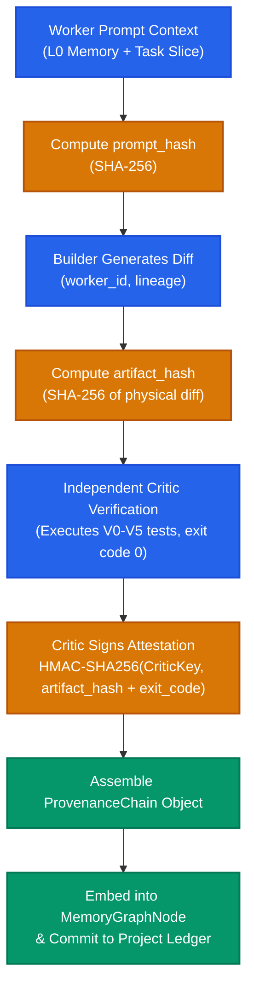

# RFC-0010: Trust and Provenance Protocol

```yaml
RFC: 0010
Title: Trust and Provenance Protocol
Status: FOUNDER_FREEZE_RELEASE_CANDIDATE
Author: AGY (Implementation Agent)
Founder: LiplnwZa
Chief Architect: ChatGPT GPT-5
Target: Forge OS Core Governance (v0.2+)
Created: 2026-09-08
Supersedes: None
Authority: LEVEL 1 (Subordinate to RFC-0000, Peer to RFC-0001)
```

---

## 1. Purpose

This specification establishes the **Trust and Provenance Protocol** for Forge OS.

In multi-agent systems where code, tests, decisions, and memories are generated by heterogeneous neural models, epistemic corruption is fatal: an agent can hallucinate an unverified function, attribute it to an imaginary critic pass, and poison the knowledge base.

The Trust and Provenance Protocol provides an end-to-end, zero-trust cryptographic chain of custody. Every memory node, task diff, verification result, and ledger event must carry verifiable cryptographic provenance: **who created it, what prompt hash induced it, what physical evidence validated it, and which independent critic certified it**.

---

## 2. Scope

1. **In-Scope**:
   - The Canonical Provenance Chain schema embedded across memory nodes, artifacts, and diffs.
   - Cryptographic attestation protocols: artifact hashing, prompt hashing, critic digital signatures.
   - Dynamic Trust Scoring algorithms for memory nodes and providers.
   - Zero-trust audit verification pipelines.
2. **Out-of-Scope**:
   - Hardware-based Secure Enclave / TPM key management (reserved for enterprise deployment).

---

## 3. Definitions

All terms conform to [`GLOSSARY.md`](GLOSSARY.md). Key terms:
- **Provenance Chain**: The linked cryptographic metadata proving the origin, lineage, and verification history of an artifact or memory node.
- **Prompt Hash**: The SHA-256 digest of the exact system and user prompt context that induced a worker output.
- **Critic Attestation**: The cryptographic statement signed by an independent Critic certifying physical test execution ($V_0$–$V_5$).
- **Trust Score**: A mathematical confidence metric $[0.0, 1.0]$ derived from empirical verification depth and failure resistance.

---

## 4. Invariants

1. **Unbroken Chain of Custody**: No memory node or code diff may be promoted to the project state without a valid, structurally complete `provenance_chain`.
2. **Critic Cryptographic Attestation**: Physical verification results ($V_0$ to $V_5$) must be signed by the Critic's worker key, asserting the physical tool exit code and artifact hash.
3. **Prompt Reproducibility**: The `prompt_hash` must uniquely resolve to the cached turn context in $L_0$, allowing exact forensic replay of worker actions.
4. **Zero-Trust Memory Admission**: Any memory node failing signature verification or parent node existence checks is rejected during ingestion.

---

## 5. Interfaces & Schemas

### 5.1 End-to-End Cryptographic Chain of Custody



---

### 5.2 Canonical Provenance Chain Schema

```json
{
  "$schema": "http://json-schema.org/draft-07/schema#",
  "title": "ForgeProvenanceChain",
  "type": "object",
  "required": [
    "author_worker_id",
    "provider_lineage",
    "prompt_hash",
    "parent_node_ids",
    "evidence_node_ids",
    "critic_attestation"
  ],
  "properties": {
    "author_worker_id": { "type": "string" },
    "provider_lineage": { "type": "string", "description": "Lineage family of author model" },
    "prompt_hash": { "type": "string", "pattern": "^[a-f0-9]{64}$" },
    "parent_node_ids": { 
      "type": "array", 
      "items": { "type": "string" },
      "description": "Preceding causal memory nodes in the graph"
    },
    "evidence_node_ids": { 
      "type": "array", 
      "items": { "type": "string" },
      "description": "Associated E0 physical evidence nodes"
    },
    "critic_attestation": {
      "type": ["object", "null"],
      "required": ["critic_id", "critic_lineage", "verification_level", "physical_exit_code", "signature"],
      "properties": {
        "critic_id": { "type": "string" },
        "critic_lineage": { "type": "string" },
        "verification_level": { 
          "type": "string", 
          "enum": ["V0_SYNTAX", "V1_COMPILE", "V2_UNIT", "V3_INTEGRATION", "V4_INVARIANT", "V5_OUTSIDER"] 
        },
        "physical_exit_code": { "type": "integer", "enum": [0] },
        "signature": { "type": "string", "description": "HMAC or digital signature asserting evidence validity" }
      }
    }
  }
}
```

---

### 5.3 Provenance Validation Algorithm

```typescript
export interface ProvenanceVerifier {
  /** Validates that a node's provenance chain is unbroken and cryptographically sound */
  verifyProvenance(node: MemoryGraphNode, activeLedgerHash: string): ProvenanceValidationResult;
}

export interface ProvenanceValidationResult {
  valid: boolean;
  critic_orthogonality_satisfied: boolean;
  evidence_intact: boolean;
  calculated_trust_score: number;
  errors: string[];
}
```

$$\text{AttestationMessage} = \text{artifact\_hash} \mathbin{\Vert} \text{verification\_level} \mathbin{\Vert} \text{physical\_exit\_code} \mathbin{\Vert} \text{critic\_id}$$
$$\text{SignatureValid} = \operatorname{Verify}(\text{CriticKey}, \text{AttestationMessage}, \text{critic\_attestation.signature})$$

---

## 6. Failure Cases

1. **Critic Self-Attestation Collusion**: A rogue worker generates a diff and signs its own critic attestation.  
   *Defense*: Provenance Verifier asserts `author_worker_id != critic_id` and checks lineage orthogonality; collusive node rejected.
2. **Altered Physical Evidence**: Test log in `.forge/artifacts/` is altered after the critic pass.  
   *Defense*: Node records `artifact_hash`; hash mismatch invalidates the provenance chain immediately.
3. **Broken Dependency Link**: Node references a parent ID that was rolled back or never committed.  
   *Defense*: Graph consistency checker traverses `parent_node_ids`; broken links prevent node admission to $L_1$ Project Memory.

---

## 7. Security Considerations

1. **Key Separation**: Worker processes are assigned distinct ephemeral symmetric keys for signing attestations, preventing key theft from compromising the supervisor or Founder credentials.
2. **Immutable Hashing**: All hashes utilize standard SHA-256; truncation or MD5/SHA-1 usage is strictly prohibited.

---

## 8. Examples

### Example: Verified Provenance Chain Record
```json
{
  "author_worker_id": "worker-builder-alpha-04",
  "provider_lineage": "lineage:alpha-models",
  "prompt_hash": "e3b0c44298fc1c149afbf4c8996fb92427ae41e4649b934ca495991b7852b855",
  "parent_node_ids": ["mem-0191a2b3c4d5"],
  "evidence_node_ids": ["mem-e0-test-pass-14"],
  "critic_attestation": {
    "critic_id": "worker-critic-beta-02",
    "critic_lineage": "lineage:beta-models",
    "verification_level": "V2_UNIT",
    "physical_exit_code": 0,
    "signature": "sig-hmac-sha256-9a8b7c6d5e4f3a2b1c0d..."
  }
}
```

---

## 9. Architecture Corrections

1. **Standardized Provenance Schema**: Unified ad-hoc node attribution into a formal `provenance_chain` specification with cryptographic signing.
2. **Explicit Critic Attestation**: Replaced verbal critic reports with a signed `critic_attestation` object asserting physical verification levels ($V_0$–$V_5$).

---

## 10. References to Related RFCs

- [**RFC-0000: The Forge Constitution**](RFC-0000_FORGE_CONSTITUTION.md) — Law II (Independent Verification) and Article IV (Memory Graph Sovereignty).
- [**RFC-0001: The Kernel Contract**](RFC-0001_KERNEL_CONTRACT.md) — Uses provenance chains to evaluate ratchet gates.
- [**RFC-0002: Memory Graph Protocol**](RFC-0002_MEMORY_GRAPH_PROTOCOL.md) — Embeds `provenance_chain` into every memory node.
- [**RFC-0004: Provider Capability Matrix**](RFC-0004_PROVIDER_CAPABILITY_MATRIX.md) — Enforces lineage orthogonality on provenance chains.
- [**RFC-0006: Project Ledger Protocol**](RFC-0006_PROJECT_LEDGER_PROTOCOL.md) — Records provenance evidence references in the event DAG.
- [**RFC-0007: Forge Ratchet Protocol**](RFC-0007_FORGE_RATCHET_PROTOCOL.md) — Requires verified provenance for Phase 1 gate clearance.
